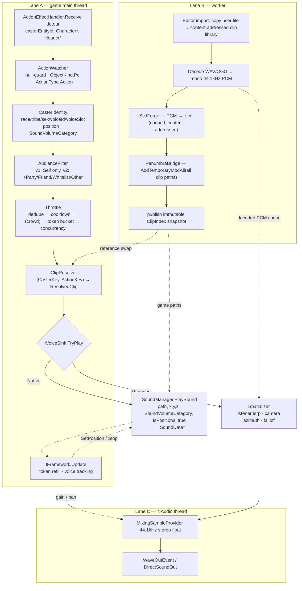

# FFXIV Action Voicelines — Implementation Plan

**Target:** Dalamud plugin, **API level 15** (Dalamud 15.0.3.2 / .NET 10 / FFXIV 7.55-era)
**Drafted:** 2026-08-17
**Working title:** `Warcry` — *placeholder.* It becomes the `InternalName`, the config directory name and the repo manifest key. **Pick the real name before M1**; changing it later orphans user configs.

## Locked decisions

| Decision | Choice | Consequence |
|---|---|---|
| **v1 audience scope** | **Local player only** | Remote detection, crowd throttling and per-player identity deferred to v2. The audience filter still exists as a *seam* from day one. |
| **Distribution** | **Self-hosted third-party repo** | No DalamudPluginsD17 review queue, no "no internet at build time" rule, no licence scrutiny by reviewers. You own the `pluginmaster.json` and the release pipeline. |
| **Native audio** | **A hard Penumbra dependency is acceptable** for the native path | The native spike is worth running, and the `.scd`-via-Penumbra route is on the table rather than being a blocker. |
| **Pack authoring** | **In-game ImGui mapping editor** | The editor is the *primary* authoring surface. JSON is a storage/interchange format the plugin writes, not something users hand-edit. This is a significant UI investment — budget for it. |

> **Confidence note.** Everything below was researched against live primary sources on 2026-08-16/17, then put through adversarial verification. All three verifiers on the first research pass returned **`partly-wrong`** — the corrections are already folded in. Items still marked **⚠** are *not* verified and must be confirmed at first compile or by in-game test. Do not write code against a ⚠ item without checking it first.

---

## 0. Build status

### Milestone state — 2026-08-17

| M | Name | State |
|---|---|---|
| M0 | Skeleton + toolchain | ✅ done |
| M1 | Detection + Diagnostics | ✅ done — hook live, Events/Status/Sheets tabs, voice-slot table |
| M2 | Native spike | ✅ **GO, 2026-08-17.** A clip we encoded, in a container we assembled, played through the game's own engine. Route: clone a real `Vo_Battle` SCD at runtime → encode mono **MS-ADPCM** (`0x0C`, 50-byte `WAVEFORMATEX` header, confirmed against a real entry) → append past EOF and retarget **only the scoped group's** audio indices → serve from a **content-addressed** synthetic path via Penumbra → `PlaySound(soundNumber: group)`. Remaining work is engineering, not research: PLAN §6 criteria (b)–(e) have still never been reached. Full history below. |
| M3 | Managed sink | ✅ done — and the cast offset came out **better than planned** (measured per-event, no slider) |
| M4 | Clip library + profiles + resolution | ✅ done — content-addressed library, profiles, resolver with fallback chain, weighted variants, no-immediate-repeat |
| M5 | In-game editor | 🟡 **partly done, and past plan scope in places** — searchable action combo, job filter, observed-action learning, drag-drop + file-dialog import, per-mapping pitch, bulk pitch apply, action-family matching. Missing: action icons, virtualised table, bulk assign by category/job, resolution-trace test panel |
| M6 | Settings, throttle, gates | ❌ **not started — the biggest functional gap** |
| M7 | Native sink | 🟢 **unblocked** — M2 came back GO. `ScdForge` is now a known quantity: `ScdWriter.PointAudioAtOneEntry` + `MsAdPcm` + `PenumbraBridge`, all proven in game. Two constraints shape the design: a resource handle is cached per path for the life of the game process, so **each distinct clip needs its own content-addressed path and one pre-warm play**; and `ReleaseSoundData` does not appear to decrement `SoundResourceHandle.SoundDataRefCount`, so resource lifetime needs a real answer before shipping. Still gated on §6 (b)–(e). **The managed sink remains the default** — this is an opt-in enhancement, not a replacement. |
| M8 | Release + repo | ❌ not started; csproj still carries `TODO-your-name` |
| M9 | v2: other players | ❌ not started; the audience filter seam exists and only `Self` is enabled |

**What M6's absence actually means today:** there is **no throttle of any kind**. Nothing but the hard concurrency cap of 3 stops an oGCD-heavy burst from stacking voicelines, and there are **no PvP, cutscene, gpose or territory gates** — so lines fire during cutscenes. The plan itself calls audio annoyance the highest-likelihood failure mode, and that whole layer is missing.

**Still open from M1:** `ActionId` vs `SpellId` has shown **no divergence** in testing, so the key choice is *untested* rather than settled. `ActionId` remains the key. The Events tab computes the agreement count and has a mismatch filter if it ever appears.

**New since the plan was written:** the game's own battle grunt is **animation-driven, fixed per action, 5–1071 ms after snapshot** (see `docs/native-spike.md`). That kills the single-offset auto-calibration idea in §5.1 and replaces it with a better one — the plugin could *learn* a per-action delay table by watching. Not built.

---

**M0 + M1 code complete — 2026-08-17.** Clean Debug + Release build, 0 warnings, 0 errors, against the locally installed Dalamud **15.0.3.2** / FFXIVClientStructs **7.55.1.8875** / Lumina **7.6.0** / Lumina.Excel **7.5.1**. M1 awaits in-game confirmation of the ActionId/SpellId verdict.

**Confirmed in game (M0 run, male Hrothgar of The Lost):**

| Question | Answer |
|---|---|
| Does `Character.Vfx.VoiceId` hold the character-creation voice? | **Yes.** Read `130`, which falls inside the predicted Hrothgar-exclusive range 121–144. |
| Do the race/tribe byte offsets read sensibly? | **Yes.** `race=7` (Hrothgar), `tribe=14` (The Lost) — mutually consistent. |
| Is `Character+0x2369 SoundVolumeCategory` meaningful? | **Yes.** Read `0` = `Player` for the local player, as expected. |
| Does `SoundMicpos` resolve? | **Yes** — its ConfigOption ID was ⚠; it returned `10` on the 0–100 scale. |
| **`IsSnd*` polarity** | **They are MUTE flags — `true` means muted.** All three read `False` while `SoundMaster=27` and the game was audible; the alternative reading implies a silent client. Confirm with a checkbox toggle when convenient, but implement against "true = muted". |

All seven `Sound*` volume keys resolved with values in 0–100. None returned `NOT FOUND`.

The M0 window deliberately exercises the API surface this plan flags, so a wrong name fails at compile time. **These ⚠ items are now resolved — the names are real and compile at API 15:**

| Was ⚠ | Now |
|---|---|
| `IPlayerState` exists as an injectable service, with `.EntityId` / `.ContentId` | ✅ compiles |
| `Character.Vfx.VoiceId` — the field, not the customize byte | ✅ compiles |
| `Character.DrawData.CustomizeData` `.Race` / `.Tribe` / `.Sex` | ✅ compiles |
| `Character.SoundVolumeCategory` | ✅ compiles |
| `IObjectTable.LocalPlayer` (replacing removed `IClientState.LocalPlayer`) | ✅ compiles |
| `IDragDropManager` in `Dalamud.Interface.DragDrop`, with `.ServiceAvailable` | ✅ compiles |
| `Dalamud.Bindings.ImGui` namespace + `ImGui` type | ✅ compiles |
| `ITextureProvider.GetFromGameIcon(new GameIconLookup(id))` → `.GetWrapOrEmpty().Handle` → `ImGui.Image` | ✅ compiles (the `ImTextureID` rename is real and `.Handle` is correct) |
| `IGameConfig.System.TryGetUInt` / `TryGetBool` | ✅ compiles |
| Lumina `Action` rows as structs; `IsPlayerAction`, `Icon`, `sheet.Count`, `foreach` over the sheet | ✅ compiles |
| `BattleChara.GetCastInfo()` → `CurrentCastTime` / `TotalCastTime` | ✅ compiles — but `IsCasting` is a **`bool`**, not a byte |
| `IClientState.TerritoryChanged` | ⚠ **`Action<uint>`** at API 15, *not* `Action<ushort>` as in older Dalamud |
| NAudio 2.3.0 `MixingSampleProvider` / `VolumeSampleProvider` / `PanningSampleProvider` / `SinPanStrategy` / `WaveOutEvent` / `DirectSoundOut` / `MixerInputEnded` | ✅ compiles |
| `Dalamud.Utility.Util.IsWine()` / `Util.OpenLink()` | ✅ compiles |
| `FileDialogManager` — ctor, `OpenFileDialog` multi-select overload (`Action<bool, List<string>>` + `selectionCountMax`), `Reset()` | ✅ compiles |
| `Window.PostDraw()` override for pumping the dialog | ✅ compiles |
| `IDragDropManager.CreateImGuiSource` / `CreateImGuiTarget` / `ServiceAvailable` / `Extensions.Overlaps` | ✅ compiles |
| `SoundManager.PlaySound` — the full 18-arg member-function delegate | ✅ compiles; note **`a9` is `int`** and path is `InteropGenerator.Runtime.CStringPointer`, not `byte*` |
| `SoundVolumeCategory`, `SoundBus` (Voice **= 3**), `SoundData` fields | ✅ verified by reflection |
| NAudio `VorbisWaveReader`, `StereoToMonoSampleProvider`, `WdlResamplingSampleProvider` | ✅ compiles |
| `ICustomizeData` declaring namespace | ⏭ sidestepped — the unsafe `Character*` route is used instead, so this never needs answering |
| **`ActionEffectHandler.Delegates.Receive`** — the whole 6-arg shape | ✅ compiles first try |
| `ActionEffectHandler.Addresses.Receive.Value` | ✅ compiles |
| `Header` fields `.ActionId` `.SpellId` `.AnimationVariation` `.GlobalSequence` `.SourceSequence` `.ActionType` `.NumTargets` | ✅ compiles |
| `targetPos` really is `System.Numerics.Vector3*` (not the FCS `Common.Math` one) | ✅ compiles |
| `ActionEffectHandler.TargetEffects`, `GameObjectId`, `ActionType.Action` | ✅ compiles |
| `Hook<T>.OriginalDisposeSafe`, `IGameInteropProvider.HookFromAddress<T>` | ✅ compiles |
| `Character.GameObject.NameString` as a `string` property | ✅ compiles |
| `CharaMakeType` — `row.Race.RowId`, `row.Gender`, `row.VoiceStruct.Count`, indexer | ✅ compiles |
| `Race` / `Tribe` sheets `.Masculine` / `.Feminine` | ✅ compiles |
| `sheet.TryGetRow(id, out var row)` and `RowRef<T>.ValueNullable` | ✅ compiles |

**Still runtime-only — no amount of compiling settles these.** The M0 window displays every one of them live; read them in game:
`IsSndMaster` polarity · `VoiceId` vs your `CharaMakeType` row · ARR voice-slot ordering · `ActionId` vs `SpellId` (needs M1's hook) · camera handedness · whether `SoundMicpos` resolves at all.

Also measured: DalamudPackager emits `bin\<Config>\Warcry\latest.zip` + `Warcry.json` on Release only, with `DalamudApiLevel: 15` filled in automatically. `packages.lock.json` is generated and **must be committed**.

---

## 1. What we're building

A Dalamud plugin that watches every action (spell / weaponskill / ability) the player executes, decides via a throttle whether it deserves a voiceline, resolves a user-assigned audio clip from a **voice profile** keyed on the character's race / gender / in-game voice type, and plays that clip positioned in 3D at the character's location — ideally through the game's own audio engine so it obeys the native volume sliders.

### The one decision everything else hangs off

**Hook exactly one game function — `ActionEffectHandler.Receive` — and put every audio output behind a single `IVoiceSink` interface.**

Two statements, one architectural move: *put the uncertainty behind a seam.*

`ActionEffectHandler.Receive` is the funnel for the `ActionEffect1/8/16/24/32` server packets. It fires **once per action**, **identically for local and remote casters**, with the action ID already unscrambled, and (per BossMod's in-source comment) is not called at all when the caster object doesn't exist — so `casterPtr` is essentially always a live, positioned game object. One hook replaces five packet handlers, needs no deduplication, and yields caster identity + world position + action ID in a single callback. Four independent shipping plugins hook this same function today (BossMod, DeathRecap, DamageInfoPlugin, NoClippy).

There is **no Dalamud service-level event for action usage** — `IGameNetwork` was removed outright and `IFlyTextGui` carries no caster identity. Hooking is mandatory, and this is the hook.

Choosing this hook rather than the local-player-only `ActionManager.UseActionLocation` is what makes **v2 (other players) nearly free** — same callback, different filter. That is why v1-is-self-only costs almost nothing architecturally.

`IVoiceSink` exists because the native-audio question is genuinely open and we must be able to ship without answering it.

### Honest verdict on the native audio channel

**Viable in principle, unproven in practice. Worth a time-boxed spike. Must not be on the critical path.**

The good news is better than expected. `Client::Sound::SoundManager::PlaySound` is fully mapped in FFXIVClientStructs and takes, in one call: an `.scd` path, a float volume, an **(x, y, z) world position**, an `isPositional` flag, and a **`SoundVolumeCategory`** whose members are documented in-source as driving `ConfigOption.SoundPlayer` / `SoundParty` / `SoundOther` — the game's own "your character / party members / other players" sound-effect sliders. Better still, the game *pre-computes* which category each character belongs to and stores it at `Character+0x2369`, so we can pass the game's own classification straight through. The returned `SoundData*` exposes `SetPosition` / `SetVolume` / `Stop`, so a voiceline can follow a moving character.

The bad news, plainly:

1. **Nobody has done it end-to-end.** Every component is individually verified; the *integration is novel*. XivVoices hooks `PlaySound` only to **mute** game lines — its own audio goes out through NAudio. "Soundy" and Artemis Roleplaying Kit generate `.scd` files and inject them via Penumbra but let the *game* trigger playback. No reference implementation exists.
2. **You cannot produce a `.scd` in pure managed code today.** VFXEditor — the reference SCD implementation (MIT) — shells out to bundled native executables (`oggenc2.exe`, `adpcmencode3.exe`, `VGAudioCli.exe`) and reuses a canned `vorbis_header.bin` because it does not even synthesise the Vorbis header. **The spike's job is to find out whether a simpler codec (PCM, or hand-written MS-ADPCM) is playable.**
3. **`PlaySound` takes a game path through the resource system.** No evidence it accepts an absolute filesystem path — hence Penumbra. *You have accepted this dependency, so it is no longer a blocker, just a prerequisite.*
4. **⚠ The "set SCD `BusNumber = 3` to land on the Voice bus" claim is an inference, not a fact.** VFXEditor's `BusNumber` is an unmapped `ParsedByte`; ClientStructs' `SoundBus` enum is referenced only by `GetEffectiveVolume`/`SetVolume`, never by `PlaySound`. The `SoundVolumeCategory` → Player/Party/Other slider link **is** solid. The Voice-bus link is not.

So: the plugin ships with the native path off, and the managed sink is deliberately engineered to *imitate* native behaviour — reads the game's own volume options, lerps the listener between camera and character using the game's `SoundMicpos` "Listening Position" setting, takes azimuth from the render camera, uses an SCD-shaped falloff curve. That is ~85% of the perceived benefit for ~15% of the risk. The native sink is what makes it *excellent*.

---

## 2. Feasibility verdict per requirement

| # | Requirement | v1? | Verdict | Evidence / fallback |
|---|---|---|---|---|
| 1a | Trigger on **local player** action use | ✅ | **Proven** | `ActionEffectHandler.Receive`, `casterEntityId == IPlayerState.EntityId`. |
| 1b | Trigger on **other players nearby** | v2 | **Proven** | Same hook, inverted comparison. Fallback: poll `IBattleChara.IsCasting`/`CastActionId` over `IObjectTable` on `IFramework.Update`. |
| 1c | Trigger at **cast start** instead of snapshot | opt | **Likely** | `PacketDispatcher.HandleActorCastPacket` is mapped; BossMod and DragoonMayCry hook it. Adds dedupe complexity. Ship snapshot-only first. |
| 2a | Granularity: **gender** | ✅ | **Proven** | `CustomizeData.Sex` @ 0x01 (`Male=0, Female=1`). |
| 2b | Granularity: **race + gender** (+ tribe) | ✅ | **Proven** | `CustomizeData.Race` @ 0x00, `.Tribe` @ 0x04. Race rows 1–8, Tribe rows 1–16. |
| 2c | Granularity: **exact in-game voice type** | ✅ | **Proven (offset ⚠)** | `Character.Vfx.VoiceId` — `ushort` at `VfxContainer+0xD0` (`Character+0x1988+0xD0 = 0x1A58`). Corroborated by `SpawnPackets` carrying `byte VoiceId` @ 0x73. **Voice is NOT one of the 26 customize bytes** — `CustomizeIndex` has no `Voice` member; index 23 is `BustSize`. Fallback: race+gender granularity. |
| 2d | Human-readable "Voice 1…12" labels | ✅ | **Proven** | `CharaMakeType` sheet: 32 rows (16 tribes × 2 genders), each with a 12-entry `VoiceStruct`; reverse-map raw id → 1-based slot. **No Excel sheet names voices** — all 7912 sheets enumerated, none exists. |
| 3a | Audience: **self** | ✅ | **Proven** | 32-bit **EntityId** comparison, not `GameObjectId`. |
| 3b | Audience: **whitelist** | v2 | **Proven** | `Character.GameObject.NameString` (@0x30) + home world → hash. |
| 3c | Audience: **friends** | v2 | **Proven** | `Character.RelationFlags` @0x1CE2 bit 2 = `IsFriend`, server-populated on the spawned object — **works without ever opening the friend list**. Dalamud surface: `ICharacter.StatusFlags & StatusFlags.Friend` (=64). |
| 3d | Audience: **party / alliance** | v2 | **Proven** | `RelationFlags` bits 0/1, or `GroupManager.Instance()->MainGroup.IsEntityIdInParty/IsEntityIdInAlliance`. Cross-world: `InfoProxyCrossRealm.IsContentIdInParty`. |
| 3e | Audience: **everyone nearby** | v2 | **Proven** | Everything reaching the hook with `ObjectKind.Pc`. |
| 4 | **Frequency throttling** | ✅ (minimal) | **Proven** | Pure managed logic. v1 needs only cooldown + concurrency; crowd scaling arrives with v2. |
| 5a | **3D positioned playback** | ✅ | **Proven** | NAudio `MixingSampleProvider` + `PanningSampleProvider` + distance gain. Precedent: XivVoices, FFXIV-ProximityVoiceChat, DragoonMayCry. |
| 5b | **Obeys native volume sliders** | ✅ | **Proven (emulated)** | `IGameConfig.System.TryGetUInt("SoundMaster"/"SoundVoice"/"SoundSe"/"SoundPlayer"/…)` + `TryGetBool("IsSndMaster"/…)`, re-applied on `IGameConfig.SystemChanged`. |
| 5c | **BONUS: routed through the game's engine** | spike | **Research-spike** | `SoundManager.PlaySound(...)` fully mapped with `[GenerateStringOverloads]`; `Character+0x2369` gives the game's own category. Blocked on: producing a valid `.scd` without native binaries, and zero prior art end-to-end. |
| 5d | BONUS: specifically the **Voice bus** | — | **⚠ Unverified / impractical to guarantee** | The `SCD BusNumber → SoundBus` link is inference. The Voice bus also has only **5 tracks**. Accept whatever bus `PlaySound` uses — slider obedience is the part users actually perceive. |
| 5e | BONUS: **occlusion / obstruction** | — | **Spike-subordinate** | SCD layout entries carry `Is_Ignore_Obstruction`, `Use_Distance_Filters`, `ReverbFac`, `DopplerFac`, so the data model supports it. Managed NAudio has **no** occlusion — say so in the README. |
| — | Suppressing the game's **own** battle grunt | opt | **Likely** | Hook `SoundManager.PlaySound`, zero `soundData->Volume` for `sound/voice/vo_battle/*` from that caster within a short window (the technique XivVoices uses — write from scratch, it is AGPL). Blunter alternative: redirect the 168 `Vo_Battle_PC_*` paths to a silent SCD via Penumbra. |
| — | **In-game mapping editor** | ✅ | **Proven, but it's real work** | Dalamud ships a file dialog and `ITextureProvider` renders game icons. See §5.8. |

---

## 3. Target platform and toolchain

### Exact versions (fetched live from `kamori.goats.dev`, 2026-08-16)

| Thing | Value |
|---|---|
| Dalamud stable | **15.0.3.2** (the `stg`/beta track is *identical* — no API 16 in flight) |
| API level | **15** (`DalamudApiLevel` = assembly major version) |
| Runtime | **.NET 10.0.0**, `RuntimeRequired: true` |
| Target framework | `net10.0-windows` — supplied by the SDK, do not set it |
| C# language version | **14.0** — supplied by the SDK |
| MSBuild SDK | **`Dalamud.NET.Sdk/15.0.0`** (latest on NuGet, published 2026-04-29) |
| Supported game version | `2026.08.11.0000.0000` (a 7.55-era hotfix) |

You already have .NET 9.0.317 and **10.0.303** installed — 10 is what you need.

> **⚠ Read Dalamud source from `master`, not `api15`.** The `api15` branch link printed on dalamud.dev is dead (404); so are `api12`–`api14` and `api16`. `master`'s `Dalamud.csproj` contains `<DalamudVersion>15.0.3.2</DalamudVersion>`.

> **⚠ Patch 7.56 is announced for 2026-09-08.** It will very likely require a Dalamud bump but is unlikely to change the API level. Plan to rebuild on patch day (see §8).

### Dev environment setup (Windows)

1. Install **XIVLauncher**, enable Dalamud, launch the game once so `%AppData%\XIVLauncher\addon\Hooks\dev\` is populated. That is where the SDK finds `Dalamud.dll` et al. (`DALAMUD_HOME` overrides it.)
2. .NET 10 SDK x64 — already present.
3. In-game `/xlsettings` → **Experimental** → enable plugin dev features, and add your build output directory to **Dev Plugin Locations**. Then `/xlplugins` → Dev Tools tab loads/reloads without restarting the game.
4. Debug by attaching Visual Studio / Rider to `ffxiv_dx11.exe` as **Managed (.NET Core)**. `IPluginLog` goes to `%AppData%\XIVLauncher\dalamud.log` and the `/xllog` window.
5. Start from **`github.com/goatcorp/SamplePlugin`** (branch `master`). Note: the solution file is `SamplePlugin.slnx`, not `.sln`, and **there is no `SamplePlugin.json` manifest any more** — manifest fields are MSBuild properties.

### The complete csproj

This is the *entire* file. No `TargetFramework`, no `DalamudLibPath`, no `<Reference>` items, no manifest JSON.

```xml
<?xml version="1.0" encoding="utf-8"?>
<Project Sdk="Dalamud.NET.Sdk/15.0.0">
  <PropertyGroup>
    <Version>0.1.0.0</Version>
    <Author>your name here</Author>
    <Name>Warcry</Name>
    <Punchline>Play your own voicelines when you use an action.</Punchline>
    <Description>Plays user-supplied audio clips in 3D space when you use actions. Clips can be mapped per action and per character voice type from an in-game editor.</Description>
    <RepoUrl>https://github.com/YOURNAME/Warcry</RepoUrl>
    <Tags>audio;voice;combat;roleplay</Tags>
  </PropertyGroup>

  <ItemGroup>
    <PackageReference Include="NAudio" Version="2.3.0" />
    <PackageReference Include="NAudio.Vorbis" Version="1.5.0" />
    <!-- M6+ only. Referencing this does NOT create a hard runtime dependency:
         IPC subscribers throw IpcNotReadyError if Penumbra is absent. -->
    <PackageReference Include="Penumbra.Api" Version="5.15.1" />
  </ItemGroup>
</Project>
```

**What the SDK gives you free** (verified from `Sdk.props`): `TargetFramework=net10.0-windows`, `LangVersion=14.0`, `Platforms=x64`, `PlatformTarget=x64`, `Nullable=enable`, `AllowUnsafeBlocks=true`, `RestorePackagesWithLockFile=true`, `CopyLocalLockFileAssemblies=true`, `EnableDefaultNoneItems=false`, `ProduceReferenceAssembly=false`, `AppendTargetFrameworkToOutputPath=false`, `Configurations=Debug;Release`. It auto-adds `DalamudPackager` 15.0.0 and `DotNet.ReproducibleBuilds` 1.2.39, plus eleven `Private="false"` references: **Dalamud, Dalamud.Bindings.ImGui, Dalamud.Bindings.ImPlot, Dalamud.Bindings.ImGuizmo, FFXIVClientStructs, InteropGenerator.Runtime, Newtonsoft.Json, Lumina, Lumina.Excel, Serilog, Microsoft.Extensions.ObjectPool**.

Because the SDK sets `RestorePackagesWithLockFile=true`, **commit `packages.lock.json`** — CI restore depends on it. All eleven auto-added references are `Private="false"`, so they are not copied to output — which is why DalamudPackager's default "zip the entire output directory" is safe with this SDK.

> **Output path — measured, not assumed.** `dotnet build Warcry\Warcry.csproj -c Release` puts the assembly at **`Warcry\bin\Release\`** and DalamudPackager's zip folder at **`Warcry\bin\Release\Warcry\`** (`latest.zip` + `Warcry.json`). The `x64` path segment that appears in SamplePlugin's CI (`bin\x64\Release\`) shows up only when MSBuild's `Platform` is explicitly set — `Platforms=x64` merely declares x64 *valid*, it does not select it. **Verify the artifact path in CI rather than copying one from another repo**; a wrong path fails as "no files found" at upload time.

> **Pin NAudio 2.3.0, not 3.0.0.** NAudio 3.0.0 shipped 2026-08-15 and is a hard breaking release: `Read(byte[],int,int)` → `Read(Span<byte>)`, `WaveOutEvent` → `WaveOut`, `WasapiOut` obsoleted for a builder-based `WasapiPlayer`, `DesiredLatency` → `BufferMilliseconds`, and the assembly split into `NAudio.Core`/`.Wasapi`/`.WinMM`. Every prior-art plugin worth learning from is on 2.x. Migrate deliberately, later, if ever.

**Licensing stance:** ship **MIT**. Read for technique, never copy, from SoundFilter / DragoonMayCry / XivVoices / VoiceDirector (all **AGPL-3.0**), and **never** from `xivdev/Penumbra` (**no licence file at all** — all rights reserved). `Penumbra.Api` (repo **`github.com/Ottermandias/Penumbra.Api`** — *not* `xivdev/Penumbra.Api`, which 404s) is MIT and safe to reference. **VFXEditor is MIT** — safe to read *and* vendor with attribution, which is what makes the SCD writer tractable.

Choosing a custom repo removes reviewer scrutiny but **does not change copyright law**. The AGPL boundary above still applies.

### Plugin.cs skeleton

```csharp
using System;
using Dalamud.Game.Command;
using Dalamud.Interface.Windowing;
using Dalamud.IoC;
using Dalamud.Plugin;
using Dalamud.Plugin.Services;
using Warcry.Audio;
using Warcry.Detection;
using Warcry.Packs;
using Warcry.Windows;

namespace Warcry;

public sealed class Plugin : IDalamudPlugin
{
    // NOTE: [PluginService] is AttributeTargets.Property — a FIELD will not compile.
    [PluginService] internal static IDalamudPluginInterface PluginInterface { get; private set; } = null!;
    [PluginService] internal static IPluginLog             Log        { get; private set; } = null!;
    [PluginService] internal static IFramework             Framework  { get; private set; } = null!;
    [PluginService] internal static IGameInteropProvider   Interop    { get; private set; } = null!;
    [PluginService] internal static IObjectTable           Objects    { get; private set; } = null!;
    [PluginService] internal static IPlayerState           PlayerState{ get; private set; } = null!;
    [PluginService] internal static IClientState           ClientState{ get; private set; } = null!;
    [PluginService] internal static ICondition             Condition  { get; private set; } = null!;
    [PluginService] internal static IDataManager           Data       { get; private set; } = null!;
    [PluginService] internal static IGameConfig            GameConfig { get; private set; } = null!;
    [PluginService] internal static ICommandManager        Commands   { get; private set; } = null!;
    [PluginService] internal static ITextureProvider       Textures   { get; private set; } = null!;

    private const string CommandName = "/warcry";

    public Configuration    Config     { get; }
    public VoiceSlotTable   VoiceSlots { get; }
    public ClipLibrary      Clips      { get; }
    public ProfileStore     Profiles   { get; }
    public ClipResolver     Resolver   { get; }
    public AudienceFilter   Audience   { get; }
    public Throttle         Throttle   { get; }
    public IVoiceSink       Sink       { get; private set; }
    public Diagnostics      Diag       { get; }

    private readonly ActionWatcher watcher;
    private readonly WindowSystem  windows = new("Warcry");
    private readonly ConfigWindow  configWindow;

    public Plugin()
    {
        Config     = PluginInterface.GetPluginConfig() as Configuration ?? new Configuration();
        Diag       = new Diagnostics();
        VoiceSlots = VoiceSlotTable.Build(Data);           // reads CharaMakeType once
        Clips      = new ClipLibrary(PluginInterface.GetPluginConfigDirectory(), Log);
        Profiles   = new ProfileStore(PluginInterface.GetPluginConfigDirectory(), Log);
        Resolver   = new ClipResolver(Profiles, Clips, Diag);
        Audience   = new AudienceFilter(Config);
        Throttle   = new Throttle(Config, Diag);
        Sink       = VoiceSinkFactory.Create(Config, Log);  // Managed by default; Native only if probed OK

        watcher = new ActionWatcher(Interop, Log, OnCast);  // installs the hook
        Framework.Update += OnFrameworkUpdate;

        configWindow = new ConfigWindow(this);
        windows.AddWindow(configWindow);
        PluginInterface.UiBuilder.Draw         += windows.Draw;
        PluginInterface.UiBuilder.OpenConfigUi += configWindow.Toggle;
        PluginInterface.UiBuilder.OpenMainUi   += configWindow.Toggle;

        Commands.AddHandler(CommandName, new CommandInfo(OnCommand)
        {
            HelpMessage = "Open Warcry. /warcry test fires a test line.",
        });

        // Clip scanning + decoding is off-thread; never block the ctor.
        _ = Clips.RescanAsync();
    }

    // Called on the GAME MAIN THREAD from inside the ActionEffect detour.
    private void OnCast(in CastEvent ev)
    {
        var bucket = Audience.Classify(in ev);
        if (bucket == AudienceBucket.None) { Diag.Drop(DropStage.Audience); return; }
        if (!Throttle.Admit(in ev, bucket))                                 return;

        var clip = Resolver.Resolve(in ev, bucket);
        if (clip is null) { Diag.Drop(DropStage.NoClip); return; }

        Sink.TryPlay(new VoiceRequest(clip, ev.Position, ev.SoundCategory, bucket, ev.CasterEntityId));
    }

    private void OnFrameworkUpdate(IFramework fw)
    {
        Throttle.Tick(fw);
        Sink.Update();          // follow the caster / reap finished voices
    }

    private void OnCommand(string command, string args) => configWindow.Toggle();

    public void Dispose()
    {
        // Order matters: stop producing events before tearing down consumers.
        watcher.Dispose();
        Framework.Update -= OnFrameworkUpdate;
        Sink.Dispose();                       // native: Stop() + ReleaseSoundData + Penumbra teardown
        Clips.Dispose();
        Commands.RemoveHandler(CommandName);
        PluginInterface.UiBuilder.Draw         -= windows.Draw;
        PluginInterface.UiBuilder.OpenConfigUi -= configWindow.Toggle;
        PluginInterface.UiBuilder.OpenMainUi   -= configWindow.Toggle;
        windows.RemoveAllWindows();
        PluginInterface.SavePluginConfig(Config);
    }
}
```

> **Do not use `IAsyncDalamudPlugin`.** New in v15 and marked experimental (`Task LoadAsync(CancellationToken)`). Construct fast synchronously and push work to a `Task`, as above. ⚠ The reported 60-second load/unload timeout comes from changelog prose, not source.

### API 15 compile traps you *will* hit

| Trap | Reality |
|---|---|
| `IClientState.LocalPlayer` | **Removed.** Use `IObjectTable.LocalPlayer` (`IPlayerCharacter?`). |
| `IClientState.LocalContentId` | **Removed.** Use `IPlayerState.ContentId`. |
| `ObjectKind.Player` | **Does not exist.** It is `ObjectKind.Pc` (=1). This is the real v15 rename hidden behind the "re-synced with FFXIVClientStructs" changelog line. Confusingly `Player` *does* still exist on the different enum `BattleNpcSubKind` (=4). |
| Two `ObjectKind` enums exist | **Match the enum to the object you are holding — this is not "always use Dalamud's".** Dalamud source-generates a clone into `Dalamud.Game.ClientState.Objects.Enums` (see `EnumCloneMap.txt`), and `IGameObject.ObjectKind` returns *that* type. But a raw `Character*` from a hook exposes `GameObject.ObjectKind` as the **FCS** type — comparing *those* against Dalamud's clone is CS0019. In the detour, alias the FCS one: `using CSObjectKind = FFXIVClientStructs.FFXIV.Client.Game.Object.ObjectKind;`. A generated `ObjectKindConversions.ToDalamudObjectKind()` converts when you need to cross over. *(Verified at M1 — an earlier draft of this plan had the detour using Dalamud's enum, which does not compile.)* |
| `ICharacter.Customize` as `byte[]` | Now **`Span<byte>`**. |
| `PluginInterface.AddChatLinkHandler` | Moved to `IChatGui`. |
| `IChatGui.ChatMessage` old signature | Replaced by `OnHandleableChatMessageDelegate(IHandleableChatMessage)` + `ChatMessageHandled`/`ChatMessageUnhandled`. Not needed here, but you'll hit it in old sample code. |
| `HookBackend.MinHook` / `.Reloaded` | Both `[Obsolete]`. **Omit the backend argument.** |
| `HookAddress<T>` | **⚠ Not a Dalamud API.** It is a BossMod-internal wrapper. Copying BossMod snippets verbatim will not compile. Use `IGameInteropProvider.HookFromAddress<T>` / `HookFromSignature<T>`. |
| `Service.Hook` / `Service.GameInteropProvider` in samples | Each plugin's own `[PluginService]` property names, not framework names. |
| `ImGuiNET` | Replaced by **`Dalamud.Bindings.ImGui`** — an auto-referenced *assembly*, not a NuGet package. |
| `IDalamudTextureWrap.ImGuiHandle` | Renamed to **`.Handle`** in API 13, and the type changed from `nint` to `ImTextureID`. `ImGui.Image` takes `ImTextureID`, which has an implicit conversion **only from `ulong`** — an `nint` will not convert. Pass `wrap.Handle` straight through; wrap a raw pointer as `new ImTextureID(myNint)`. |
| `Lumina.Excel.Sheets.Action` | Collides with `System.Action`. **You must alias it**: `using GameAction = Lumina.Excel.Sheets.Action;`. This is the single most common compile error in this domain. |
| Lumina rows as nullable classes | Rows are **structs** implementing `IExcelRow<T>`. Use `sheet.TryGetRow(id, out var row)` / `RowRef<T>.ValueNullable` — not `?.`. |

### 3.6 Distribution: your own plugin repository

Verified against `goatcorp/Dalamud` master (= the API-15 line) and two live third-party repos.

**The repo file is a top-level JSON array**, deserialized by Newtonsoft as `List<RemotePluginManifest>`:

```csharp
var pluginMaster = JsonConvert.DeserializeObject<List<RemotePluginManifest>>(data);
```

If you generate it from PowerShell, `ConvertTo-Json -AsArray` is mandatory — a single-entry file serialised as a bare object fails to deserialise. (Penumbra's CI does exactly this.)

**Required or the entry is silently dropped** (`PluginRepository.IsValidManifest`): `InternalName`, `Name`, `AssemblyVersion`. Required in practice: `DalamudApiLevel`, `DownloadLinkInstall`. Everything else optional; `ApplicableVersion` defaults to `any`, and **`DalamudApiLevel` defaults to whatever API level the running Dalamud is** — a trap, since omitting it reads as 15 today and 16 tomorrow. Always state it explicitly.

There is **no `Dependencies` field** in the Dalamud manifest schema. Don't emit one; it does nothing.

A minimal working entry:

```json
[
  {
    "Author": "you",
    "Name": "Warcry",
    "Punchline": "Play your own voicelines when you use an action.",
    "Description": "Longer text shown when the installer entry is expanded.",
    "InternalName": "Warcry",
    "AssemblyVersion": "0.1.0.0",
    "RepoUrl": "https://github.com/YOURNAME/Warcry",
    "ApplicableVersion": "any",
    "DalamudApiLevel": 15,
    "DownloadLinkInstall": "https://github.com/YOURNAME/Warcry/releases/download/0.1.0.0/latest.zip",
    "DownloadLinkUpdate":  "https://github.com/YOURNAME/Warcry/releases/download/0.1.0.0/latest.zip",
    "DownloadLinkTesting": "https://github.com/YOURNAME/Warcry/releases/download/0.1.0.0/latest.zip",
    "IconUrl": "https://raw.githubusercontent.com/YOURNAME/Warcry/main/images/icon.png",
    "Tags": ["audio", "combat"],
    "AcceptsFeedback": false,
    "IsHide": false,
    "DownloadCount": 0,
    "LastUpdate": 0
  }
]
```

Notes: `DownloadLinkUpdate` is **dead weight** — it appears exactly once in the entire Dalamud repository (its own declaration); both install and update read `DownloadLinkInstall`. Emit it anyway, since every real repo does. `AcceptsFeedback` is inert for third-party plugins — the feedback button is hard-disabled for them regardless. Point users at GitHub issues via `RepoUrl`.

**Five things that will bite you:**

1. **InternalName collisions are fatal and silent.** Before the validity check, Dalamud filters out any third-party entry whose `InternalName` matches an official-repo plugin *case-insensitively*, logging only `"tried to replace the plugin X, which is already installed through the official repo"`. Pick a name not taken in DalamudPluginsD17.
2. **Your repo depends on the official repo loading.** If `kamori.goats.dev` fails, every third-party repo is marked `Fail` regardless of its own health.
3. **Never change the pluginmaster URL after publishing.** The exact URL string is persisted per install as `InstalledFromUrl`, and repo matching is ordinal string equality. Change it and every existing install is orphaned — and `LoadAsync` *hard-throws* on orphaned plugins.
4. **Never remove an entry while users still have it installed** — that makes the plugin `IsDecommissioned` and it silently stops auto-loading.
5. **The zip contract is strict.** `<InternalName>.dll` and `<InternalName>.json` at the zip **root** (no wrapping folder), and the in-zip `AssemblyVersion` must equal the repo entry's `AssemblyVersion` **exactly** as a `System.Version` — `"1.2.3"` ≠ `"1.2.3.0"`. Mismatch throws on install. Never ship a `WorkingPluginId`.

**Update detection** compares the repo manifest's `AssemblyVersion` against the *installed manifest's*, never the DLL's real version — and additionally requires `candidateApiLevel == DalamudApiLevel` **exactly**. A manifest below the running API level refuses to load outright (`PluginPreconditionFailedException`), though dev plugins are exempt. The installer is one notch looser and still *shows* `>= DalamudApiLevel - 1` as "outdated".

**Users add the repo** at `/xlsettings` → **Experimental** → "Custom Plugin Repositories". There is a mandatory **15-second speedbump** behind a scary warning the first time. `http` is accepted, but use `https`. Dalamud fetches with `Cache-Control: no-cache` and a 20 s timeout — but `raw.githubusercontent.com` has its own ~5-minute edge cache Dalamud can't bust, so a freshly-pushed manifest can lag a release.

**DalamudPackager does not generate the repo file.** Its `Manifest` class has no `DownloadLink*` / `IsHide` / `DownloadCount` / `LastUpdate` / `Testing*` fields at all. It emits `$(OutputPath)/$(AssemblyName)/latest.zip` + `$(AssemblyName).json` + `images/`. The pluginmaster is yours to generate — the cleanest pattern is UnknownX7's: commit DalamudPackager's per-plugin `<InternalName>.json` and derive the download links, `DownloadCount` and `LastUpdate` from it with a small script.

> **⚠ Manifest source precedence is a silent footgun.** DalamudPackager resolves `json` → `yaml` → `csproj` and **first hit wins with no merge and no warning**. A `Warcry.json` sitting next to the csproj makes every one of your `<Author>`/`<Name>`/`<Punchline>`/… properties dead. **Pick csproj-only**, so `<Version>` is the single source of truth. (`AssemblyVersion` and `InternalName` are always overwritten from the built assembly regardless, so hand-writing them is futile.)

**CI gets Dalamud with no XIVLauncher install** by downloading the distrib zip. This is the real, current pattern from `goatcorp/SamplePlugin`'s own workflow:

```yaml
- uses: actions/checkout@v5
- uses: actions/setup-dotnet@v5
  with:
    dotnet-version: 10.0.x
- name: Download Dalamud
  run: |
    Invoke-WebRequest -Uri https://goatcorp.github.io/dalamud-distrib/latest.zip -OutFile latest.zip
    Expand-Archive -Force latest.zip "$env:AppData\XIVLauncher\addon\Hooks\dev"
- run: dotnet build --configuration Release
- uses: actions/upload-artifact@v4
  with:
    # Verify this path against a real local build — it has no x64 segment unless
    # MSBuild's Platform is explicitly set. Ours is bin\Release\Warcry\.
    path: .\Warcry\bin\Release\Warcry\*
    if-no-files-found: error
```

`DALAMUD_HOME` (no trailing slash — the SDK appends one) is the alternative to writing into `%AppData%`, though no third-party repo actually uses it in CI.

> **⚠ Only `latest.zip` and `stg/latest.zip` are current** (both 15.0.3.2). `rc/` is on 11.0.6.0, `canary/` on 14.0.4.0, and — counter-intuitively — **`api15/` is stale** (14.0.5.2-pre) because the `apiN/` folders archive the *last* build before `latest` moved on. Do **not** pin CI to `api15/`.

For the full release pipeline, copy Penumbra's shape: tag push → build with `/p:Version=$tag` → patch the packaged `<InternalName>.json`'s AssemblyVersion from the tag → GitHub Release → rewrite and commit `repo.json` from the same tag. That guarantees the three version numbers can't drift.

**Testing channel** (optional) needs *all three*: `TestingAssemblyVersion` **strictly greater** than `AssemblyVersion`, `TestingDalamudApiLevel` present and **exactly equal** to the running API level, and `DownloadLinkTesting`. Omitting `TestingDalamudApiLevel` silently disables the whole channel.

**Other consequences of going custom:** third-party plugins are excluded from auto-update under the common `UpdateMainRepo` setting; the installer labels yours "Custom Repository" under a filter checkbox users can untick; and goatcorp's ban list still applies (keyed on `InternalName` or its SHA-256). Most importantly — **on a patch-day API bump, every user's copy is `IsOutdated` and refuses to load until you publish a rebuild, and no D17 pipeline does that for you.**

---

## 4. Architecture

### Threading model — three lanes, one rule

**Lane A — game main / framework thread.** The `ActionEffectHandler.Receive` detour runs here (proven: DeathRecap calls `IObjectTable.SearchById` inside it, and `ObjectTable` calls `ThreadSafety.AssertMainThread()`, which throws **in all build configurations**, not just Debug). `IFramework.Update` also runs here. **Everything** touching the object table, Lumina sheets, `IGameConfig`, FFXIVClientStructs pointers or `SoundManager` happens here and only here. Native `PlaySound` is called synchronously from here — same thread, same call the game makes for its own grunts.

**Lane B — worker (`Task` / ThreadPool).** Clip library scanning, JSON parsing, audio decode, resampling, SCD transcoding, file watching, config writes. Never touches game memory. Publishes results *upward* as immutable snapshots via `Volatile.Write` of a reference; Lane A only reads a reference and dereferences immutable data. **No locks on Lane A, ever.**

**Lane C — NAudio audio thread** (managed sink only). Owned by `WaveOutEvent`, pulling from a `MixingSampleProvider`. Lane A hands it work through a `ConcurrentQueue` drained on the mixer's next read. Per-voice gain/pan are `volatile float` fields updated by Lane A each frame, with a **5 ms linear ramp inside the sample provider** to avoid zipper noise. (XivVoices omits this and it is audibly clicky — ten lines of code to fix.)

**The rule:** the detour must never allocate, never lock, never do I/O, never `await`. Its whole job is: null-check → cheap gate → read ~8 fields off `Character*` → two hash lookups → either call `PlaySound` or enqueue a struct.

### Data flow



### Components

| Component | Responsibility |
|---|---|
| `Plugin` | Composition root, service injection, deterministic teardown, circuit breaker. |
| `ActionWatcher` | Owns hooks; converts packet payloads into an allocation-free `CastEvent`; cheap gating. |
| `CasterIdentity` + `VoiceSlotTable` | Reads race/tribe/sex/voiceId/position/sound-category off `Character*`; builds the `CharaMakeType` voice-slot map at load. |
| `AudienceFilter` | Classifies each cast into one bucket; applies global gates (PvP, cutscene, gpose, territory). **v1 ships with only `Self` enabled** but the full classifier is written. |
| `Throttle` | Admission control; per-stage drop counters for the UI. |
| `ClipLibrary` | Owns the imported audio files; content-addressed; decodes and caches PCM off-thread. |
| `ProfileStore` | The user's voice profiles and action→clip mappings. Authored by the editor, persisted as JSON. |
| `ClipResolver` | `(CasterKey, ActionKey)` → clip, with a human-readable resolution trace. |
| `IVoiceSink` | The seam. `NativeVoiceSink`, `ManagedVoiceSink`, `NullSink`, plus a `CompositeSink` that demotes native→managed on strike counts. |
| `ScdForge` + `PenumbraBridge` | M6+ only. Transcode to `.scd`; register game-path redirects. |
| `Diagnostics` | Ring buffer of the last 200 pipeline decisions; backs the Status tab and settles the ActionId/SpellId question. |

---

## 5. Subsystem specs

### 5.1 Action detection

**Hook target.** `FFXIVClientStructs.FFXIV.Client.Game.Character.ActionEffectHandler.Receive` — a **static** partial member function, verified verbatim:

```csharp
[MemberFunction("E8 ?? ?? ?? ?? 48 8B 8D ?? ?? ?? ?? 48 33 CC E8 ?? ?? ?? ?? 48 81 C4 00 05 00 00")]
public static partial void Receive(
    uint casterEntityId, Character* casterPtr, Vector3* targetPos,
    Header* header, TargetEffects* effects, GameObjectId* targetEntityIds);
```

Because it is static, the InteropGenerator emits `ActionEffectHandler.Delegates.Receive` with **no `thisPtr`**. `Header` (0x28 bytes):

| Offset | Field |
|---|---|
| 0x00 | `GameObjectId AnimationTargetId` |
| 0x08 | `uint ActionId` |
| 0x0C | `uint GlobalSequence` |
| 0x10 | `float AnimationLock` |
| 0x14 | `uint BallistaEntityId` |
| 0x18 | `ushort SourceSequence` |
| 0x1A | `ushort RotationInt` (0 → −π, 65535 → π) |
| 0x1C | `ushort SpellId` |
| 0x1E | `byte AnimationVariation` |
| 0x1F | `byte ActionType` |
| 0x20 | `byte Flags` (bit0 `ShowInLog`, bit1 `ForceAnimationLock`) |
| 0x21 | `byte NumTargets` |

**Installation** — two equivalent real Dalamud entry points:

```csharp
_hook = Interop.HookFromAddress<ActionEffectHandler.Delegates.Receive>(
            ActionEffectHandler.Addresses.Receive.Value, ReceiveDetour);
// or:
_hook = Interop.HookFromSignature<ActionEffectHandler.Delegates.Receive>(
            ActionEffectHandler.Addresses.Receive.String, ReceiveDetour);
_hook.Enable();
```

`InteropGenerator.Runtime.Address` exposes `public readonly string String;` (the signature) and `public nint Value;` (resolved address). **Never write your own signature string** — always consume `Addresses.Receive.String` so you inherit the ClientStructs maintainers' patch-day work.

**The detour:**

```csharp
using CSObjectKind = FFXIVClientStructs.FFXIV.Client.Game.Object.ObjectKind;  // see note below
using FFXIVClientStructs.FFXIV.Client.Game;            // ActionType
using FFXIVClientStructs.FFXIV.Client.Game.Character;  // ActionEffectHandler, Character
using FFXIVClientStructs.FFXIV.Client.Game.Object;     // GameObjectId
using FFXIVClientStructs.FFXIV.Client.Sound;           // SoundVolumeCategory
using SNVector3 = System.Numerics.Vector3;             // the targetPos param type

private unsafe void ReceiveDetour(
    uint casterEntityId, Character* casterPtr, SNVector3* targetPos,
    ActionEffectHandler.Header* header, ActionEffectHandler.TargetEffects* effects,
    GameObjectId* targetEntityIds)
{
    _hook.OriginalDisposeSafe(casterEntityId, casterPtr, targetPos, header, effects, targetEntityIds);

    if (_tripped || !_cfg.Enabled) return;
    try
    {
        if (casterPtr == null || header == null) return;                  // NOT a CS contract — guard it
        if (casterPtr->GameObject.ObjectKind != CSObjectKind.Pc) return;  // Pc, not Player
        if ((ActionType)header->ActionType != ActionType.Action) return;  // skip Item/Mount/PetAction/...

        var ev = new CastEvent(
            casterEntityId: casterEntityId,
            caster:         casterPtr,
            actionId:       header->ActionId,       // see "ActionId vs SpellId" below
            animationId:    header->SpellId,
            variation:      header->AnimationVariation,
            globalSequence: header->GlobalSequence,
            position:       casterPtr->GameObject.Position,   // FFXIV.Common.Math.Vector3 @ +0xB0
            soundCategory:  (SoundVolumeCategory)casterPtr->SoundVolumeCategory);  // @ +0x2369

        _onCast(in ev);
    }
    catch (Exception ex)
    {
        Plugin.Log.Error(ex, "Warcry pipeline threw inside ActionEffect detour");
        if (Interlocked.Increment(ref _faults) > 20)
        {
            _tripped = true;   // circuit break: keep the hook installed but inert
            Plugin.Log.Error("Warcry: too many pipeline faults — disabled until reload.");
        }
    }
}
```

**Type gotcha:** the `targetPos` parameter is `System.Numerics.Vector3`, but `GameObject.Position` @0xB0 is `FFXIVClientStructs.FFXIV.Common.Math.Vector3`. Layout-compatible, different types — it bites at compile time.

**Identifying yourself:** `casterEntityId == Plugin.PlayerState.EntityId`, or pointer identity `(nint)casterPtr == Plugin.Objects.LocalPlayer?.Address` (NoClippy's approach).

> **Never use `Header.SourceSequence` as a "was it me" test.** It means "was this action client-initiated", is a *caster-side* property, is `0` for some of your own actions (NIN mudras, certain specials — NoClippy comments "This is 0 for some special actions"), and is non-zero for remote players' client-initiated actions. BossMod requires *both* `casterID == PlayerState.EntityId` **and** `SourceSequence != 0` before touching animation lock, which tells you `SourceSequence` alone is not an identity test.

**⚠ Unresolved: `Header.ActionId` (0x08) vs `Header.SpellId` (0x1C).** Shipping plugins genuinely disagree — BossMod builds `ActionID` from `header->ActionId`; DeathRecap looks up the `Action` sheet with `header->SpellId` for normal actions and only uses `ActionId` for Mount/Item; DamageInfoPlugin calls 0x1C "AnimationId". **Do not guess.** Carry both on `CastEvent`, key mappings on `ActionId`, and ship the Diagnostics tab in M1 logging `(ActionId, SpellId, sheet name for each)`. **Settle it empirically before the editor writes user mappings** — changing the key afterwards invalidates everyone's work.

**Dedupe.** If you hook only `Receive`: **no dedupe needed at all** — one invocation per `ActionEffectN` packet. *(Held up in M1 testing: no action was observed firing twice. Note an AoE hitting 8 targets is still ONE call carrying `NumTargets = 8` — which is exactly why. Not yet stress-tested against the awkward cases: delayed ground AoEs like Earthly Star and Salted Earth, channelled actions, and NIN mudras.)* If you add secondary triggers, key on `(casterEntityId, header->GlobalSequence)` in a 256-entry LRU ring of structs. **Skip dedupe entirely when `GlobalSequence == 0`** — 0 is a live sentinel the game itself uses (BossMod special-cases it); a naive `HashSet<uint>` would permanently suppress that whole class of events. Fall back to `(casterEntityId, actionId, 250 ms tick bucket)`. Reap the ring on `IClientState.TerritoryChanged`.

#### Snapshot fires before the cast bar completes — the offset problem

*Observed in game at M1: for cast-time spells the event lands roughly half a second before the cast visually finishes.*

This is not the hook misbehaving. `Receive` fires at **snapshot** — the moment the server resolved the action — and that genuinely precedes the client-side cast bar filling. The gap **is** the slidecast window: the reason you can move during it and still get the cast off. Which means:

> **⚠ The gap is substantially latency-dependent, not a fixed game constant.** A player on a worse connection sees a larger window. So a hardcoded offset cannot be correct for everyone, and the setting must be user-visible rather than baked in.

**DECIDED (project owner, 2026-08-17): the line lands when the cast is actually finished — impact, not incantation.** So this offset is on the critical path, not an optional polish item, and `TriggerPhase.CastStart` is demoted to an opt-in alternative rather than a candidate default.

**Preferred mechanism — measure, don't guess.** M1 captures the caster's cast-bar state at snapshot (`CastEvent.WasCasting` / `.CastCurrent` / `.CastTotal` / `.CastRemaining`, read from `BattleChara.GetCastInfo()`). **If the bar is still running when `Receive` arrives, then `CastRemaining` at that instant *is* the exact offset for that specific cast** — per-event, inherently latency-correct, no user tuning and no calibration hook. Schedule playback that many seconds out and the line lands as the bar completes.

**✅ CONFIRMED IN GAME 2026-08-17: `WasCasting` reads true, and `CastRemaining` measured `0.40–0.46 s` across repeated casts.**

That band is the finding, not just the mean. It is *tight* and it does *not* scale with cast time — consistent with a latency-driven window plus jitter, not a fixed fraction of the cast. A hardcoded constant would therefore be wrong by up to ±30 ms on any individual cast, which is around the threshold where audio desync becomes perceptible on a sharp transient. Per-event measurement removes that error class entirely.

**Honest limit:** playback can only be dispatched on `IFramework.Update`, so ~16 ms of frame quantisation remains at 60 fps no matter what. The measurement's advantage is not sub-frame precision — it is that it self-calibrates per player and adapts when ping shifts mid-session. **Scheduling rule: fire on the first frame at or after the target — err late, never early**, since earliness was the original complaint. The bar really is still running at snapshot, so the measured route is live and **M3 ships no offset slider at all** — playback is scheduled against the per-event measurement. The fixed-constant fallback below is dead code unless something later invalidates this.

⚠ Two things to keep an eye on rather than block for:
- **Haste.** `TotalCastTime` must reflect the *adjusted* cast (Ley Lines, spell speed), not the base. If `+left` looks wrong under haste, this is why.
- The risk that the game clears cast state *inside* `Receive` did not materialise here, but the Events tab prints `(bar gone)` if it ever does.

**Fallback design (only if the measurement stops working):**

```csharp
public bool ApplyCastOffset { get; set; } = true;
public int  CastOffsetMs    { get; set; } = 500;   // tune per connection
```

Three rules, in order of how easy they are to get wrong:

1. **Gate on cast time, never apply globally.** Only delay when the action's `Action.Cast100ms > 0`. Instants (abilities, most weaponskills) have no gap at all — delaying them would introduce the very problem we're fixing. The Events tab now shows a **Cast** column precisely so this correlation is visible.
2. **Delay, don't re-trigger.** The event is already captured; the sink schedules the play `CastOffsetMs` later on `IFramework.Update`. This is a deliberate offset, *not* a throttle backlog — the throttle's "drop, don't queue" rule (§5.7) still applies to admission. Cooldowns start at trigger time, not at play time.
3. **Pending plays must be cancellable.** The caster can die, despawn or zone in the gap. Drop any pending play whose caster entity id is no longer resolvable, and clear the queue on `TerritoryChanged`.

**Better than guessing: measure it.** The game's own battle grunt is the ground truth we actually want to match. Hooking `SoundManager.PlaySound` and logging the timestamp of any `sound/voice/vo_battle/*` from the local player, versus our own event timestamp, yields the real per-player offset directly — and that hook is needed anyway for grunt suppression. Auto-calibration ("play a cast spell, we'll measure it") becomes a one-button feature. Worth doing at M7 alongside the suppression work rather than at M3.

**Auto-calibration, if the measured route fails.** The game's own battle grunt is the ground truth. Hooking `SoundManager.PlaySound` and logging any `sound/voice/vo_battle/*` from the local player, versus our event timestamp, yields the real per-player offset. That hook is needed anyway for grunt suppression, so "cast something, we'll measure it" is nearly free at M7 — but only pursue it if `CastRemaining` turns out to be unavailable.

**Optional secondary triggers**, both config-toggled, both feeding the same pipeline with a `TriggerPhase` tag:

*Self, on input* — fires at keypress rather than at snapshot:
```csharp
_useLocHook = Interop.HookFromAddress<ActionManager.Delegates.UseActionLocation>(
    (nint)ActionManager.MemberFunctionPointers.UseActionLocation, UseActionLocationDetour);
```
Hook **`UseActionLocation` only, never both it and `UseAction`** — `UseAction` calls into it, so double-hooking double-fires. ClientStructs' own remark: *"The function name is a bit misleading — this function is called internally for all actions, not necessarily location-targeted ones."* Gate on the `ActionManager.LastUsedActionSequence` (`ushort` @ `+0x120`) delta across `Original` so you only fire when a request actually reached the server (BossMod's idiom).

*Remote, on cast start* (v2) — fires ~3.5 s earlier for a Fire III (Action row 152, `ActionCategory` 2, `Cast100ms` 35):
```csharp
_castHook = Interop.HookFromSignature<PacketDispatcher.Delegates.HandleActorCastPacket>(
    PacketDispatcher.Addresses.HandleActorCastPacket.String, ActorCastDetour);
// static: (uint entityId, ActorCastPacket* packet)
```
`ActorCastPacket` (0x20): `SpellId` 0x00, `ActionType` 0x02, `OmenDelay` 0x03, `ActionId` 0x04, `CastTime` 0x08, `TargetEntityId` 0x0C, `RotationInt` 0x10, `Interruptible` 0x12, `BallistaEntityId` 0x14, `_positionInt` 0x18.

**Documented limitation (v2):** `Receive` is not called when the caster object isn't streamed in, so casters beyond streaming range produce **no event at all**. Acceptable (they'd be inaudible) but state it in the README rather than presenting it only as an upside.

---

### 5.2 Caster identity resolution

Voice ID is **not** in the customize bytes. The live per-character value is `Character.Vfx.VoiceId` — `ushort` at `VfxContainer+0xD0` (`Character+0x1988+0xD0`). That the server transmits it for every nearby player is corroborated by `SpawnPackets` carrying `[FieldOffset(0x73)] public byte VoiceId;`.

```csharp
using CSChar = FFXIVClientStructs.FFXIV.Client.Game.Character.Character;

public readonly record struct CasterKey(byte Race, byte Tribe, byte Sex, ushort VoiceId, byte VoiceSlot);

private static unsafe CasterKey ReadKey(CSChar* c, VoiceSlotTable slots)
{
    ref var cd = ref c->DrawData.CustomizeData;   // Character+0x6F8 (DrawData) +0x220 (CustomizeData)
    byte race  = cd.Race;    // 0x00 — Race sheet row: 1 Hyur … 8 Viera
    byte tribe = cd.Tribe;   // 0x04 — Tribe sheet row: 1 Midlander … 16 Veena
    byte sex   = cd.Sex;     // 0x01 — Male=0, Female=1
    ushort voice = (ushort)(c->Vfx.VoiceId & 0xFF);   // mask defensively: ushort here, byte on the wire
    return new CasterKey(race, tribe, sex, voice, slots.SlotOf(race, sex, voice));
}
```

Managed equivalent for the non-hot path (allocates an `ICharacter` wrapper — UI code only):
```csharp
var cd = chara.CustomizeData;                 // ⚠ verify the declaring namespace of ICustomizeData
byte race = cd.Race, tribe = cd.Tribe, sex = cd.Sex;
// or: chara.Customize[(int)CustomizeIndex.Race]  — Customize is Span<byte> as of v15
ushort voice = ((CSChar*)chara.Address)->Vfx.VoiceId;
```

**`VoiceSlotTable`** is built once at load from `IDataManager.GetExcelSheet<CharaMakeType>()` — 32 rows (16 tribes × 2 genders), each with a 12-entry `VoiceStruct`. It yields `(race, sex) → ushort[12]` and the reverse `(race, sex, voiceId) → 1-based slot`. ⚠ The exact Lumina accessor names (`row.VoiceStruct`, `row.Gender`, element type) need a compile-time check.

Two facts from the live sheet data that drive the whole matching model:

1. **Voice sets are per race+gender, never per tribe.** The two tribes of a race always share an identical 12-entry list.
2. **A raw voice ID does not uniquely determine race.** The six ARR race+gender combos each have 8 "native" IDs plus 4 shared with another ARR race — e.g. IDs 33/35/37/39 appear for *both* Hyur-Midlander-M and Elezen-M. So **`voiceId` alone is an unsafe key**; `(race, sex, voiceId)` and the derived `voiceSlot` are safe. Au Ra (97–120), Hrothgar (121–144) and Viera (145–168) get contiguous exclusive ranges. Both genders exist for all 16 tribes post-Dawntrail.

There is **no Excel sheet naming voices** — verified by enumerating all 7912 sheets. Label them "Voice 1…12" exactly as the character creator does; that is what `voiceSlot` is for.

> **⚠ Two things to verify in M1.** (a) Read `Vfx.VoiceId` for your own character and confirm it appears in your tribe+gender's `CharaMakeType.VoiceStruct` row. (b) The 12-entry `VoiceStruct` for ARR races interleaves as (native, native, foreign)×4 rather than listing 12 native IDs — so the array may not be a simple "UI slot 0..11" for ARR races. Au Ra/Hrothgar/Viera are cleanly sequential. **Verify the ARR ordering in-game before labelling packs "Voice 1..12" for ARR races.**

Race/Tribe display names: `Lumina.Excel.Sheets.Race` / `Tribe`, fields `.Masculine` / `.Feminine`, picked by the `Sex` byte (they differ in DE/FR/JA clients).

**Gate on `ObjectKind.Pc` before trusting any of this.** For BattleNpcs, EventNpcs, mounts and minions the customize bytes are meaningless and `Vfx.VoiceId` is not a `CharaMakeType` voice.

---

### 5.3 Audience filter

```csharp
[Flags] public enum AudienceBucket : byte
{ None = 0, Self = 1, Whitelist = 2, Party = 4, Alliance = 8, Friend = 16, Other = 32 }
```

**v1 ships with `EnabledBuckets = Self` and the other tiers greyed out in the UI with a "coming in v2" note.** Write the full classifier anyway — it is ~60 lines and it is what makes v2 a feature flag rather than a refactor.

Single ordered pass on Lane A, first match wins. The winning bucket carries allow/deny, a priority tier (Self = 3, Whitelist = 2, Party/Alliance/Friend = 1, Other = 0), a gain trim, and a cooldown override.

| Filter | Exact API | Notes |
|---|---|---|
| **Self** | `casterEntityId == Plugin.PlayerState.EntityId` | Compare the **32-bit EntityId**, not `GameObjectId`. `IPlayerState.EntityId` is valid even in frames where the game object isn't spawned. |
| **Blocklist** (before all but Self) | `xxHash64(nameUtf8 ‖ homeWorldId)` → `HashSet<ulong>` | Hard drop. |
| **Whitelist** | Same hash. Name from `casterPtr->GameObject.NameString` (generated from `FixedSizeArray64<byte> _name` @0x30). | ⚠ Verify the `Character.HomeWorld` offset. On miss, fall back once to `IObjectTable.SearchByEntityId(id) as IPlayerCharacter` → `.HomeWorld.RowId` (main thread, legal, but allocates — memoise per entity ID per zone). |
| **Friend** | `casterPtr->IsFriend` (bit 2 of `RelationFlags`, byte @ `+0x1CE2`) | Server-populated on the spawned object — works **without the friend list ever being opened**. Dalamud surface: `ICharacter.StatusFlags & StatusFlags.Friend` (=64). |
| **Party** | `casterPtr->IsPartyMember` (bit 0) | Or `GroupManager.Instance()->MainGroup.IsEntityIdInParty(entityId)`. Cross-world backstop: `InfoProxyCrossRealm.IsContentIdInParty(ulong)`. |
| **Alliance** | `casterPtr->IsAllianceMember` (bit 1) | Or `IsEntityIdInAlliance`. **If you use `IPartyList` instead, beware: `IPartyList[i]` silently returns an *alliance* member when `Length > 8`.** Enumerate `GetAllianceMemberAddress(i)` for i in 0..19 explicitly. |
| **Other** | Everything else with `ObjectKind.Pc` | |

**Global gates**, evaluated before the bucket, all config-toggled — *these matter in v1*:
- `IClientState.IsPvP` (default: silent in PvP)
- `ICondition[ConditionFlag.OccupiedInCutSceneEvent]` and `[ConditionFlag.WatchingCutscene]` — ⚠ verify exact member names against `Dalamud.Game.ClientState.Conditions.ConditionFlag`
- `IClientState.IsGPosing`
- Territory allow/deny list keyed on `IClientState.TerritoryType`

Note the split available: `Character+0x2369 SoundVolumeCategory` is *the game's own* Player/Party/Other classification. Use **our** bucket for *policy* (which profile, which cooldown) and **the game's** category for *volume routing*. Different questions, both one byte.

---

### 5.4 Voice profiles and the clip library

> This section is rewritten from the original research plan because you chose the **in-game editor** as the authoring surface. The disk format still exists — but the plugin writes it, not the user.

#### Two separate stores

**1. The clip library** — the audio files themselves, content-addressed:

```
%AppData%\XIVLauncher\pluginConfigs\Warcry\
  clips\
    3f2a1c9d….wav        ← copied in by the editor's import, named by SHA-256 of contents
    a71b0e42….ogg
  clipmeta.json          ← hash → { originalFileName, durationMs, sampleRate, channels, importedAt }
  profiles.json          ← the mappings (below)
  .cache\
    pcm\<sha256>.raw     ← decoded mono 44.1kHz float PCM
    scd\<sha256>.scd     ← M6+ only
```

Content-addressing matters: the user picks `C:\stuff\fire.wav` in a file dialog; we **copy** it in and key the mapping on the hash. Their mapping never breaks when they move or rename the source file, and importing the same clip twice costs nothing.

**2. Profiles** — the mappings, authored in the editor:

```jsonc
{
  "schema": 1,
  "profiles": [
    {
      "id": "e6b1…",                       // generated GUID, stable
      "name": "My BLM (Au Ra F, Voice 3)",
      "enabled": true,
      "priority": 100,                      // tie-break ONLY; specificity always dominates
      "gain": 1.0,
      "cooldownSeconds": null,              // null = inherit the global default

      // ── MATCH ────────────────────────────────────────────────────────────
      // Every field optional. Omitted or [] = matches anything.
      // Specificity = 1*sex + 2*race + 3*tribe + 4*voiceSlot + 8*voiceId
      // Profiles sort by (specificity DESC, priority DESC, id ASC).
      // THAT ORDERING *IS* THE FALLBACK CHAIN — no special-case code exists.
      "match": {
        "sex":       [1],                   // 0 Male, 1 Female
        "race":      [6],                   // 1 Hyur … 6 Au Ra … 8 Viera
        "tribe":     [],
        "voiceSlot": [3],
        "voiceId":   []
      },

      // ── RULES ────────────────────────────────────────────────────────────
      // Sorted by rule specificity DESC (actionIds 8, jobs 4, categories 2, cast predicate 1).
      // All `when` sub-fields AND together; empty array = wildcard.
      "rules": [
        {
          "id": "r1",
          "when": { "actionIds": [141, 147, 152] },      // Fire, Fire II, Fire III
          "clips": [
            { "hash": "3f2a1c9d…", "weight": 3, "gain": 1.0 },
            { "hash": "a71b0e42…", "weight": 1, "pitchJitter": 0.04 }
          ]
        },
        {
          "id": "r2",
          "when": { "categories": [2], "minCastSeconds": 0.1 },   // ActionCategory 2 = Spell
          "clips": [ { "hash": "c04d…" } ]
        }
      ]
    }
  ]
}
```

**Why profiles still key on race/gender/voice even though v1 is self-only:** you have alts. A profile matching "Au Ra F, Voice 3" fires on that character and stays silent on your Lalafell. It is also exactly the model v2 needs for other players, so nothing is thrown away.

**Rule `when` object:** `{ actionIds[], categories[], jobs[], minCastSeconds, maxCastSeconds, phases[] }`.
**Clip object:** `{ hash, weight = 1, gain = 1.0, pitchJitter = 0.0, minDelayMs = 0 }`.

> **⚠ `ActionCategory` values.** 1 = Auto-attack and 2 = Spell are source-confirmed (DeathRecap checks `RowId == 1`; Fire III is category 2). 3 = Weaponskill and 4 = Ability are **inferred**. Verify against the `ActionCategory` sheet in M1 and surface the real names in the editor's category dropdown rather than hardcoding them.

**Accepted input audio: WAV (PCM 8/16/24/32, any sample rate) and OGG Vorbis only.** No MP3 — `MediaFoundationReader` is a Wine landmine and `Util.IsWine()` branching is maintenance tax. `NAudio.Vorbis.VorbisWaveReader` handles OGG (DragoonMayCry precedent).

**Validation is strict and visible.** Missing clip hash, unreadable audio, clip > 15 s, zero samples — each becomes a row in the editor with a jump-to-fix button. A broken profile still loads its valid rules. **A broken load never replaces a good snapshot.**

**Export/import** (post-v1, ~1 day): zip `profiles.json` + the referenced clips into a `.warcrypack`. This is how sharing eventually works, and content-addressing makes dedupe on import trivial.

---

### 5.5 Resolution algorithm

**Key design decision: fallback is per `(caster, action)`, not per caster.** You can have a hyper-specific profile that only voices Limit Breaks for your exact voice ID, plus a generic "any female" profile covering everything else, and both work simultaneously. This falls out of resolving lazily.

```csharp
ResolvedClip? Resolve(in CasterKey key, in ActionKey action, ref ulong rng)
{
    foreach (var p in _snapshot.Profiles)         // pre-sorted by specificity DESC; linear is fine
    {
        if (!p.Enabled)                 continue;
        if (!p.Match.Accepts(in key))   continue; // conjunction over 5 optional sets

        foreach (var rule in p.Rules)             // pre-sorted by rule specificity DESC
        {
            if (!rule.Accepts(in action)) continue;
            var clip = rule.PickWeighted(ref rng, avoidLast: _lastClip.Get(key, rule.Id));
            if (clip is null) continue;           // rule had only broken clips
            return new ResolvedClip(p, rule, clip);
        }
        // profile matched the caster but had no rule for this action → fall through to the NEXT profile
    }
    return null;                                  // silence is a valid answer
}
```

**Fallback chain**, most specific → least:
`voiceId (+race+sex)` → `voiceSlot (+race+sex)` → `tribe+sex` → `race+sex` → `sex` → wildcard → **silence**.

Not hand-coded — an emergent property of the specificity sort. Adding a granularity later is one JSON field plus one weight constant.

**Randomisation:** cumulative weights over a per-caster `xoshiro` state (no `Random.Shared` contention, no allocation), with **"don't repeat the immediately previous clip when the rule has ≥2 clips."** This is the single highest-value anti-annoyance measure in the whole plugin.

**Memoisation:** cache the winning *rule* (not the random pick) in `Dictionary<(CasterKey, uint actionId), RuleRef>`. Drop the whole cache when the snapshot reference changes. Steady state: one dictionary hit per cast.

**Resolution trace:** `Resolve` also fills a small struct recording which profiles were skipped and why. Costs nothing and powers the editor's test panel — the single most valuable UI element in the plugin.

---

### 5.6 Audio engine

#### Chosen library: **NAudio 2.3.0 + NAudio.Vorbis 1.5.0** (both MIT)

Rejected, with reasons:

| Candidate | Verdict |
|---|---|
| **CSCore** | Dead — last release 1.2.1.2, Oct 2017, .NET Framework 3.5. |
| **SharpAudio** | Abandonware — 1.0.65-**beta**, Nov 2022. |
| **Silk.NET.OpenAL + OpenAL Soft** | The only realistic route to true managed HRTF, but `Silk.NET.OpenAL.Soft.Native` is an **LGPL-2.0-or-later** native DLL in the plugin zip. Keep as a documented v2 upgrade path — our falloff models are deliberately the standard OpenAL distance models, so it is a drop-in. (Custom repo means no reviewer objection; the LGPL obligations are still yours to meet.) |
| **FMOD** | Non-starter: EULA requires a **non-waivable** in-product FMOD logo/attribution plus a closed-source blob. |
| **ManagedBass** | Wrapper is MIT but `bass.dll` is proprietary and not shipped with the package. |
| **SoundTouch.Net** (pitch/tempo) | **LGPL-2.1-or-later.** For pitch jitter use NAudio's own `SmbPitchShiftingSampleProvider` (MIT, in NAudio.Core) and avoid the question. |

#### Managed sink — DSP chain

```
WaveFileReader | VorbisWaveReader
  → ToSampleProvider()
  → StereoToMonoSampleProvider        (3D requires mono)
  → WdlResamplingSampleProvider       (→ 44100 Hz)
  → [cache the resulting float PCM, content-addressed, LRU-capped]
  → VolumeSampleProvider              (gain, 5 ms ramped)
  → PanningSampleProvider             (SinPanStrategy; Pan ∈ [−1, 1], 5 ms ramped)
  → [optional] SmbPitchShiftingSampleProvider
  → MixingSampleProvider(WaveFormat.CreateIeeeFloatWaveFormat(44100, 2)) { ReadFully = true }
  → WaveOutEvent { DesiredLatency = 100, NumberOfBuffers = 3 }
     or DirectSoundOut(deviceGuid) when Dalamud.Utility.Util.IsWine()
```

44.1 kHz because every game sound bus runs at 44100 Hz — matching keeps the two sinks tonally identical and avoids a resample if we later swap to native. `AddMixerInput`/`RemoveMixerInput` from Lane A via a lock-free queue; the mixer runs on Lane C.

**Wine/Linux is a real shipped problem** (OofPlugin's changelog literally celebrates fixing it). Branch on `Util.IsWine()` to `DirectSoundOut` + `WaveFileReader`/`VorbisWaveReader` only, no MediaFoundation. Expose a **"reload audio device"** button for hot-plugged headsets (`PlaybackStopped` with exception → rebuild output).

#### 3D positioning math

**Listener choice — read the game's setting, don't hardcode.** FFXIV's "Listening Position" slider is `SoundMicpos` (0 = Camera … 100 = Character). XivVoices uses player position only; ProximityVoiceChat uses player for distance and camera for azimuth; neither reads the setting. We do:

```csharp
float micpos = TryGetUInt("SoundMicpos", 0u) / 100f;
Vector3 listener = Vector3.Lerp(cameraPos, playerPos, micpos);
```

**Azimuth always from the render camera:**

```csharp
unsafe {
    var cam = *FFXIVClientStructs.FFXIV.Client.Graphics.Scene.CameraManager.Instance()->CurrentCamera;
    // ViewMatrix @ 0xA0; the third column points BACKWARD, hence the negation below.
    var back   = new Vector3(cam.ViewMatrix.M13, cam.ViewMatrix.M23, cam.ViewMatrix.M33);
    var camPos = ((FFXIVClientStructs.FFXIV.Client.Graphics.Scene.Object*)&cam)->Position; // base Object @ 0x50
}

var toSrc = Vector3.Normalize(new Vector3(src.X - listener.X, 0, src.Z - listener.Z));
var fwd   = Vector3.Normalize(new Vector3(-back.X, 0, -back.Z));
float angle = MathF.Atan2(Vector3.Dot(Vector3.Cross(toSrc, fwd), Vector3.UnitY), Vector3.Dot(toSrc, fwd));
float pan   = Math.Clamp(MathF.Sin(angle) * cfg.MaxPan, -1f, 1f);
```

(ProximityVoiceChat's `cosine = -dot` is the same backward-column correction, arrived at independently.)

> **⚠ Two things to determine empirically.** (a) Whether `Scene.Camera`'s inherited `Object.Position` @0x50 is the live camera world position, or whether `RenderCamera->Origin` (@0x90) or `Client.Game.Camera.LastPosition` (@0x1C0) is the lag-free one. (b) The handedness of the view matrix, and therefore the sign of the right vector — **stand east of a sound source and check which ear it comes from.**

**Distance falloff.** Default `ScdLike`: full volume inside `MinRange` (3 y), inverse-distance with `FalloffFactor` 1.5 out to `MaxRange` (25 y), silence beyond. Also offer the three standard OpenAL models (after `d = Clamp(d, min, max)`):

| Model | Formula |
|---|---|
| InverseDistance | `min / (min + f·(d − min))` |
| ExponentialDistance | `(d / min)^(−f)` |
| LinearDistance | `1 − f·(d − min)/(max − min)` |

**No occlusion, no reverb, no HRTF in the managed sink — say so in the README.** NAudio offers constant-power panning (`SinPanStrategy`, `SquareRootPanStrategy`, `LinearPanStrategy`, `StereoBalanceStrategy`) and per-channel gain, and literally nothing else positional.

*In v1 (self only) the source is always you, so distance is ~0 and pan is ~0 — the spatialiser is nearly a no-op. Build it anyway: it is what makes the `SoundMicpos` behaviour correct, and it is the whole point in v2.*

#### Volume scaling from the game's own config — exact identifiers

Read through `IGameConfig.System`. **Always `TryGetUInt` / `TryGetBool`** — `GameConfigSection.GetUInt` throws `ConfigOptionNotFoundException`. Subscribe to `IGameConfig.SystemChanged` to re-apply live.

| Purpose | String key | `ConfigOption` ID | Notes |
|---|---|---|---|
| Master volume | `SoundMaster` | 987 | ÷ 100 |
| Master mute | `IsSndMaster` | — | **⚠ Polarity unconfirmed.** Tf2CriticalHits reads it as `IsSndSe \|\| IsSndMaster ⇒ volume 0`, i.e. the flag appears to mean *muted*, not *enabled*. **Verify by toggling the in-game checkbox in M1** — getting this inverted means "mute everything" makes us loud. |
| BGM | `SoundBgm` | 988 | unused |
| Sound effects bus | `SoundSe` | 989 | ÷ 100 |
| **Voice bus** | `SoundVoice` | 990 | ÷ 100 — the natural home for a voiceline |
| Environment | `SoundEnv` | 991 | unused |
| System | `SoundSystem` | 992 | unused |
| Performance | `SoundPerform` | 993 | unused |
| **Your character SFX** | `SoundPlayer` | **994** | ÷ 100 — `SoundVolumeCategory.Player` |
| **Party member SFX** | `SoundParty` | **995** | ÷ 100 — `SoundVolumeCategory.Party` |
| **Other player SFX** | `SoundOther` | **996** | ÷ 100 — `SoundVolumeCategory.Other` |
| Listening position | `SoundMicpos` | ⚠ ID unverified | 0 = Camera, 100 = Character |
| SE / Voice mute | `IsSndSe` / `IsSndVoice` | — | same polarity caveat |

Final managed gain:

```
gain = clipGain × profileGain × bucketTrim × masterGain
     × (SoundMaster / 100)
     × (SoundVoice  / 100)          // or SoundSe, config-selectable
     × (categoryVolume / 100)       // SoundPlayer|SoundParty|SoundOther, chosen by Character+0x2369
     × falloff(distance)
gain = 0 if any of IsSndMaster / IsSndVoice / IsSndSe indicates muted
```

> **⚠ The perceptual curve of the game's 0–100 sliders is unknown** (linear amplitude vs squared vs dB). Start linear; if it feels wrong relative to game sounds, try `pow(v/100, 2)`. Matching properly needs measurement.

Note the elegance: `categoryVolume` is selected by the **same byte** the native sink passes to `PlaySound`. Both sinks make the same decision from the same source of truth — which is what makes the managed sink a credible imitation rather than a different product.

#### Native sink (M6+, spike-gated)

```csharp
using FFXIVClientStructs.FFXIV.Client.Sound;

var sm = SoundManager.Instance();                       // or Framework.Instance()->SoundManager (@0x2B88)
SoundData* sd = sm->PlaySound(
    path:            gamePath,                          // string overload exists ([GenerateStringOverloads])
    volume:          gain,
    fadeInDuration:  0,
    posX: pos.X, posY: pos.Y, posZ: pos.Z,
    speed:           1.0f,
    a9:              0,
    soundNumber:     0,
    autoRelease:     !follow,                           // false only if we intend to track it
    volumeCategory:  category,                          // (SoundVolumeCategory)casterPtr->SoundVolumeCategory
    a13:             false,
    midiNote:        -1,
    a15:             false,
    defaultFadeOut:  false,
    isPositional:    true,
    a18:             false);
if (sd == null) { /* strike this clip; demote after 3 */ }
```

`SoundVolumeCategory`: `Player = 0, Party = 1, Other = 2, Unk3 = 3, Unk4 = 4, NoPlay = 5, BypassVolumeRules = 6`.

To follow a moving character, pass `autoRelease: false`, retain the `SoundData*`, and each frame call the `ISoundData` virtuals `SetPosition(bool isPositional, float x, float y, float z)` [vf 12] / `SetVolume(float, uint fadeDuration)` [10] / `IsPlaying()` [38] / `Stop(uint fadeOutMs = 1500)` [36], then `SoundManager.ReleaseSoundData(SoundData*)`. **With `autoRelease: true` the entry is recycled after playback — the pointer must not be retained.**

> **Hard engine limits that constrain the throttle:** the global `SoundData` pool is **exactly 256 entries** (`SoundDataMemory` is `256 * 0xD0` bytes) *shared with the entire game* — exhausting it means the game itself stops being able to play sounds. The Voice bus has only **5 tracks**.

**Path allocation and the resource-cache problem.** Once a game `.scd` path is loaded, its `SoundResourceHandle` is cached; changing a Penumbra redirect afterwards will **not** cause a re-read. So do **not** rotate a small pool of paths. Assign **one stable synthetic game path per distinct clip** for the lifetime of the index:

```
sound/vfx/warcry/g{generation:D4}/{clipHash8}.scd  →  <configDir>\.cache\scd\{sha256}.scd
```

Register all of them in **one** `AddTemporaryModAll(tag: "Warcry", paths, manipString: "", priority: 0)` call at index build. Caching then works *for* us — each clip loads once and stays warm. On edit, bump `generation`, rebuild, call again with the **same tag** (Penumbra treats a repeat tag as an atomic replace). `AddTemporaryModAll` (global) is correct rather than a per-actor temporary collection, because the redirect target is a synthetic path nothing else in the game can request.

**Penumbra IPC — exact labels** (namespace `Penumbra.Api.IpcSubscribers`, package `Penumbra.Api` 5.15.1, MIT):

| Subscriber | Label | Signature |
|---|---|---|
| `CreateTemporaryCollection` | `Penumbra.CreateTemporaryCollection.` **`V6`** | `PenumbraApiEc Invoke(string identity, string name, out Guid collection)` |
| `AddTemporaryModAll` | `Penumbra.AddTemporaryModAll.V5` | `int Invoke(string tag, Dictionary<string,string> paths, string manipString, int priority)` |
| `AddTemporaryMod` | `Penumbra.AddTemporaryMod.V5` | `int Invoke(string tag, Guid collectionId, Dictionary<string,string> paths, string manipString, int priority)` |
| `AssignTemporaryCollection` | `Penumbra.AssignTemporaryCollection.V5` | `int Invoke(Guid collectionId, int actorIndex, bool forceAssignment = true)` |
| `RemoveTemporaryModAll` | `Penumbra.RemoveTemporaryModAll.V5` | |
| `RemoveTemporaryMod` | `Penumbra.RemoveTemporaryMod.V5` | |
| `DeleteTemporaryCollection` | `Penumbra.DeleteTemporaryCollection.V5` | |

Note the **V6/V5 inconsistency on `CreateTemporaryCollection`** — real and easy to get wrong. Probe availability via `IPenumbraApiBase.ApiVersion` → `(int Breaking, int Feature)`, wrap every call in try/catch, and check the returned `PenumbraApiEc`.

Penumbra's `RsfService` registers the SCD CRC for the protected-file workaround at the generic redirect site in `ResourceLoader`, which runs for **temporary** mods too — so IPC-injected SCD redirects get the same protected-file handling as on-disk mods. That was a plausible failure mode and it is already handled.

> **⚠ Investigate VFXEditor issue #277** (SCD sound mods crashing since May 2025) before committing to runtime SCD authoring. Root cause unknown — VFXEditor writer bug, Penumbra bug, or a game-side change. It bears directly on how risky this whole path is.

#### Suppressing the game's own battle grunt (optional, off by default)

When our voiceline plays, the game's native grunt for the same action may double up. Preferred lever: hook `SoundManager.PlaySound` ourselves and zero `soundData->Volume` for paths matching `sound/voice/vo_battle/*` from that caster within a ~500 ms window — the technique XivVoices uses (write from scratch; it is AGPL). Blunter alternative: redirect the **168** `sound/voice/Vo_Battle/Vo_Battle_PC_{race}_{slot}_{lang}.scd` paths (9 race codes `mid hil ele lal miq rog aur ros vie` × 42 race/gender/voice combos × 4 languages) to a silent SCD via Penumbra — global and reversible.

---

### 5.7 Throttling

Five stages, all on Lane A, fixed-capacity, zero steady-state allocation. **v1 needs only stages 0, 2 and 5** — the rest arrive with v2. Shipped defaults in **bold**.

**Stage 0 — content filters (free).** Skip `ActionCategory == 1` (auto-attack) by default. Optional "casts only" (`Action.Cast100ms > 0`), optional per-action mute list, optional "GCD only".

**Stage 1 — dedupe** *(only if >1 trigger source is enabled)*. 256-entry LRU ring of `(uint entityId, uint globalSequence)` structs, linear probe. Skip when `globalSequence == 0`; use `(entityId, actionId, 250 ms bucket)` instead.

**Stage 2 — per-caster cooldown.** `Dictionary<uint, long>` entityId → last-play tick (`Stopwatch.GetTimestamp`). Defaults: **Self 2.0 s**, *(v2: Party/Friend/Whitelist 4.0 s, Other 6.0 s)*. A rule's `cooldownSeconds` overrides the profile's, which overrides the bucket's. Reaped on `TerritoryChanged` and when the dictionary exceeds 256 entries.

**Stage 3 — crowd scaling** *(v2)*. Once per second on `IFramework.Update`, count `IObjectTable.PlayerObjects` within 30 y using `IGameObject.CurrentDistance` (a **byte in yalms** — no sqrt, no allocation with the struct enumerators). If `n > SoftCrowdLimit` (**12**), multiply all non-Self cooldowns by `1 + (n − limit)/limit`, clamped to **×6**. In a 48-player alliance raid a 6 s cooldown becomes ~24 s for randoms while Self and party stay responsive.

**Stage 4 — global token bucket** *(v2)*. Capacity **4**, refill **1 token / 1.5 s**. **Self bypasses the bucket** (but not its own cooldown). When empty, requests are **dropped, not queued** — a voiceline that arrives late is worse than one that never arrives.

**Stage 5 — concurrency cap.** Hard limit of **3** simultaneous plugin-owned sounds, plus 1 reserved for Self. **This is not a taste call** — the Voice bus has 5 tracks and the global `SoundData` pool is 256 entries shared with the whole game. The config slider needs a warning label and a ceiling (say 6).

Per-stage drop counters feed a live 60-second histogram so users can see *which* limiter is eating their voicelines.

> **⚠ Some actions legitimately emit multiple ActionEffect packets** — delayed ground AoEs (Earthly Star, Salted Earth), channelled actions, NIN mudras (BossMod hardcodes the mudra IDs as special cases). No exhaustive list exists; tune by observation with the Diagnostics tab.

**Performance budget:**

| Path | Budget |
|---|---|
| Detour, dropped by cheap gate | < 1 µs |
| Detour → `PlaySound` (native) | < 60 µs p99 |
| Detour → managed enqueue | < 25 µs p99 |
| `IFramework.Update` steady state | < 15 µs |
| `IFramework.Update`, crowd-count tick (1 Hz, v2) | < 120 µs |
| Steady-state managed allocation on hot path | **0 bytes/frame** |
| Resident memory, managed sink | < 96 MB (decoded-PCM LRU, hard cap) |
| Plugin ctor → ready | < 150 ms on Lane A |

Enforced by a `Stopwatch` sampler on 1-in-64 detour invocations, and a hard code rule: **no `new`, no LINQ, no string formatting** in the detour body outside the `DebugLogActions` branch.

---

### 5.8 Configuration and the in-game editor

> **This is the biggest single UI investment in the project and the feature you chose as the authoring surface. Budget it properly — it is not a settings panel with a few checkboxes.**

```csharp
public sealed class Configuration : IPluginConfiguration
{
    public int  Version { get; set; } = 1;
    public bool Enabled { get; set; } = true;

    // sink
    public SinkMode Sink { get; set; } = SinkMode.Auto;   // Auto | NativeOnly | ManagedOnly | Off
    public bool   FollowCaster { get; set; } = false;
    public string? ManagedDeviceId { get; set; }
    public float  MasterGain { get; set; } = 1.0f;
    public bool   RespectMasterMute { get; set; } = true;
    public bool   UseVoiceSliderNotSe { get; set; } = true;

    // triggers
    public bool TriggerOnSelf { get; set; } = true;
    public bool TriggerOnOthers { get; set; } = false;    // v2
    public bool SelfOnInput { get; set; } = false;        // UseActionLocation hook
    public bool SkipAutoAttacks { get; set; } = true;

    // Snapshot fires ~one slidecast window before the cast bar visually completes,
    // and that window scales with latency. Applied ONLY when Action.Cast100ms > 0.
    public bool ApplyCastOffset { get; set; } = true;
    public int  CastOffsetMs { get; set; } = 500;
    public HashSet<uint> MutedActionIds { get; set; } = new();

    // audience (v1: Self only)
    public AudienceBucket EnabledBuckets { get; set; } = AudienceBucket.Self;
    public List<PlayerRef> Whitelist { get; set; } = new();   // v2
    public List<PlayerRef> Blocklist { get; set; } = new();   // v2
    public bool DisableInPvP { get; set; } = true;
    public bool DisableInCutscenes { get; set; } = true;
    public HashSet<uint> BlockedTerritories { get; set; } = new();

    // throttle
    public float SelfCooldown { get; set; } = 2.0f;
    public int   MaxConcurrent { get; set; } = 3;
    public float MaxDistanceYalms { get; set; } = 25f;

    // managed spatialisation (ignored by the native sink)
    public FalloffMode Falloff { get; set; } = FalloffMode.ScdLike;
    public float MinRange { get; set; } = 3f;
    public float MaxRange { get; set; } = 25f;
    public float FalloffFactor { get; set; } = 1.5f;
    public float MaxPan { get; set; } = 0.85f;
    public bool  UseGameListeningPosition { get; set; } = true;

    public bool DebugLogActions { get; set; } = false;
}
```

**Storage split.** `Configuration` goes through `PluginInterface.SavePluginConfig(this)` (Newtonsoft, Dalamud-managed). **Profiles and clip metadata do NOT** — they live in separate `System.Text.Json` files under `GetPluginConfigDirectory()`, because they will grow to hundreds of entries and we want atomic writes, hot reload, and a format we control for export/import. Coalesce writes through `IFramework.CreateDebouncer(TimeSpan.FromSeconds(2), Save)` → `Dalamud.Utility.IDebouncer { bool IsPending; void Debounce(); void Cancel(); }`.

**UI shell.** `WindowSystem("Warcry")` with `Dalamud.Interface.Windowing.Window` subclasses; ImGui from **`Dalamud.Bindings.ImGui`**, plots from `Dalamud.Bindings.ImPlot`. Use `Dalamud.Interface.Utility.Raii` (ImRaii) disposable scopes rather than manual Push/Pop.

**Two windows, not one.**

**Window 1 — `MainWindow` (the editor).** This is where the plugin's value lives.

- **Left pane: profile list.** Add / duplicate / delete / reorder. Each row shows the match summary in human text ("Au Ra · Female · Voice 3") and a rule count. A **"Create from my current character"** button reads your live race/tribe/sex/voiceId and pre-fills the match — this is the single best onboarding affordance in the plugin.
- **Right pane, top: match editor.** Dropdowns for sex / race / tribe, and a **voice picker showing "Voice 1…12" for the selected race+gender** built from `VoiceSlotTable`, with an "any" option per field. A live line reading *"This profile is more specific than 2 others and will be checked first."*
- **Right pane, main: the mapping table.** `ImGui.BeginTable` with `Resizable | Sortable | ScrollY | RowBg`, virtualised with `ImGuiListClipper`. Columns: action icon (`ITextureProvider` game icon), action name, category, clip count, a compact clip chip list, and a ▶ audition button per row. A text filter above it, plus category / job filter dropdowns.
- **Adding a mapping:** an **action picker** popup — searchable over the Lumina `Action` sheet filtered to player actions, showing icon + name + job + category. Then an **clip assigner** — "Import audio file…" opens Dalamud's file dialog, the file is copied into the clip library, and it appears as a chip with weight/gain controls.
- **Bulk assignment** is what makes this usable: *"assign this clip to every Spell for BLM"*, *"assign to all actions in this category"*. Without it, mapping 40 actions by hand is miserable.
- **Test panel:** pick a race/sex/voice + an action and press Resolve. It prints the resolution trace — which profile won, which rule, which clip, and **why the others lost**. Nearly free because `Resolve` already produces the trace, and it is the difference between "why isn't this working" and a two-second answer.

**Window 2 — `ConfigWindow` (settings).** Tabs: **Status** (which sink and *why*, in plain English — "Native — Penumbra 5.15.1 detected, 412 clips registered" / "Managed fallback — Penumbra not found"; test-fire button; plays-per-minute; drops-by-stage), **Triggers**, **Audience** (v2 tiers visible but disabled), **Throttle**, **Audio** (sink override, device picker + reload, falloff curve with a live ImPlot preview, listening-position toggle), **Diagnostics**.

Commands via `ICommandManager`: `/warcry` (editor), `/warcry cfg`, `/warcry test`, `/warcry reload`.

> **Keep the UI layer a thin view — no business logic in the windows.** `ConfigWindow` and the editor should read and mutate `ProfileStore` / `ClipLibrary` / `Diagnostics` through a small view-model surface, never reach into the resolver's internals or hold derived state of their own. This costs nothing now and is the difference between a *reskin* and a *rewrite* if the native-UI idea below is ever taken up.

#### Post-1.0 idea: native game UI (v3)

Rebuilding the UI on the game's own Atk system (`AtkUnitBase` + `AtkResNode`/`AtkTextNode`/`AtkComponentNode`) instead of ImGui, so it matches the game's chrome, scale and theme. ⚠ Largely unresearched — treat the following as a sketch. The paved road is **`MidoriKami/KamiToolKit`**, a community library for building native nodes from a plugin; **VanillaPlus reportedly builds its entire native UI on it** *(per the project owner, not verified here)*, which makes the two worth reading together — the plugin shows what the toolkit does in practice, the toolkit shows what is available.

**The question that decides whether this is cheap or expensive:** is KamiToolKit a *compiled-in* library (NuGet / source / submodule) or a *separately-installed plugin* consumed over IPC? Compiled-in is an ordinary dependency that versions with you. Separately-installed would be a **second custom-repo runtime dependency** alongside Penumbra — and, worse, its patch-day cadence becomes your ship gate, since it must track Atk struct changes. Answer this before the idea gets a milestone number.

The costs are asymmetric and worth stating up front: teardown bugs are **client crashes**, not visual glitches; there is **no layout engine** (absolute X/Y/W/H only — every table, scrollbar and column resize is hand-built); and `AtkComponentTextInput` brings focus/IME handling. The dev loop is far slower than ImGui hot-reload.

Two blockers specific to this plugin: `FileDialogManager` is ImGui-only, so clip import would need Win32 `IFileDialog` COM interop or convention-based folder scanning; and `IDragDropManager`'s `CreateImGuiSource`/`CreateImGuiTarget` helpers are ImGui-bound — though `IsDragging` / `Files` / `Extensions` are plain properties fed by a WinAPI drop target, so native code can poll them and hit-test against its own node rects.

**Recommended shape if pursued: hybrid, not a port.** The mapping editor is the expensive thing to port and the least valuable (opened rarely, at a desk, with a mouse). The valuable, cheap surfaces are a status readout and an on/off toggle — small node trees that gain the game's UI scale, theming, HUD layout mode and auto-hide in cutscenes/gpose. **The one genuinely compelling argument is gamepad navigation:** ImGui windows are effectively unusable on a controller, and FFXIV has a large controller playerbase.

#### The APIs the editor is built from

All verified by reflection against the shipped **Dalamud 15.0.3.2** binaries, not from docs.

**Don't hand-roll the table — Dalamud ships one.** `Dalamud.Interface.Utility.Table.Table<T>` is Ottermandias' OtterGui table upstreamed into Dalamud. Subclass `Column<T>` (or `ColumnString<T>`, which gives you a per-column regex search box in the header for free, falling back to `Contains` when the regex is invalid) and you get clipping, sorting and filtering without writing any of it:

```csharp
public class Table<T>
{
    public Table(string label, ICollection<T> items, params Column<T>[] headers);
    public ImGuiTableFlags Flags = RowBg | Sortable | BordersOuter | ScrollY | ScrollX
                                 | PreciseWidths | BordersInnerV | NoBordersInBodyUntilResize;
    public void Draw(float itemHeight);
}
```

If you do hand-roll it, `Dalamud.Interface.Utility.ImGuiClip.ClippedDraw(...)` is the reference `ImGuiListClipper` pattern for `Dalamud.Bindings.ImGui`. **⚠ Dalamud's own `ClippedDraw` has a latent leak** — an early `return` inside the loop skips `End()`/`Destroy()`. Use `break` in your copy.

> **⚠ Clipper + `ScrollY` requires a fixed row height, and every row must actually be that height.** Mixing a differently-sized icon with text desyncs the scrollbar. Use `ImGui.GetTextLineHeightWithSpacing()` as both the icon size and the clipper's `lineHeight`.

**Drag-and-drop of OS files onto the game window is fully supported** — this was the pleasant surprise, and it is a much better import UX than a file dialog. `Dalamud.Interface.DragDrop.IDragDropManager` is a real WinAPI `IDropTarget` registered on the game viewports; Dalamud does all the OLE plumbing:

```csharp
[PluginService] internal static IDragDropManager DragDrop { get; private set; } = null!;

// once per frame in Draw():
DragDrop.CreateImGuiSource("AudioDragger",
    m => m.Extensions.Overlaps([".wav", ".ogg"]),
    m => { ImGui.Text($"Dragging {m.Files.Count} audio file(s) into the clip library..."); return true; });

// immediately after drawing the droppable region:
if (DragDrop.CreateImGuiTarget("AudioDragger", out var files, out var dirs))
    ImportAudioFiles(files, dirs);
```

Guard on `DragDrop.ServiceAvailable` — OLE registration can fail (Wine, or another overlay owning the drop target) — and keep the file dialog as fallback.

> **⚠ Do not copy Glamourer's snippet verbatim.** Its `Im.Text(...)` is **ImSharp**, Ottermandias' own ImGui wrapper — not Dalamud. There is no `Im` type in `Dalamud.Bindings.ImGui`. The `IDragDropManager` calls are portable; the ImGui call is not.

**File dialog** — `Dalamud.Interface.ImGuiFileDialog.FileDialogManager`, parameterless ctor, still current:

```csharp
private readonly FileDialogManager fileDialog = new();

fileDialog.OpenFileDialog("Import audio", "Audio files{.wav,.ogg},.*",
    (ok, path) => { if (ok) Import(path); });
// multi-select uses a DIFFERENT callback type: Action<bool, List<string>>
fileDialog.OpenFileDialog("Import audio", "...", (ok, paths) => {...}, selectionCountMax: 0);

public override void PostDraw() => fileDialog.Draw();   // must be pumped every frame
```

The filter string is a custom mini-syntax: `".wav,.ogg"` or `"Audio files{.wav,.ogg},.*"`. **⚠ `Window.PostDraw()` is skipped entirely on frames where the window draws in the error style**, and it runs *before* `ImGui.PopID()` for namespaced windows. If either matters, pump `Draw()` from a plain `IUiBuilder.Draw` handler outside the `WindowSystem`.

**Action picker.** Filter the sheet once at load and cache flattened rows — never hold Lumina structs or re-query per frame:

```csharp
using GameAction = Lumina.Excel.Sheets.Action;   // REQUIRED alias

var rows = Data.GetExcelSheet<GameAction>()
    .Where(a => a.IsPlayerAction
             && a.Icon != 0
             && !a.IsPvP
             && a.Name.ExtractText().Length > 0)
    // add only if you want job-restricted actions (this DROPS role and general actions):
    //       && a.ClassJob.ValueNullable.HasValue
    .Select(a => new ActionEntry(a.RowId, a.Name.ExtractText(), a.Icon, a.ClassJobLevel))
    .ToArray();
```

> **⚠ Use `ClassJob.ValueNullable.HasValue` (or `.IsValid`), not `ClassJob.RowId != 0xFFFFFFFF`.** The magic constant is unverified — Lumina's sheet structs are source-generated at build time, so the storage width isn't readable from any primary source. `RowRef<T>.IsValid` / `ValueNullable` / `TryGetValue` are verified on the shipped assembly. Also note `WrathCombo`'s `IsJobInCategory` is a *plugin-local extension* — it does not exist in Lumina.Excel 7.5.1 and will not compile.

**Icons** — call fresh every frame; `ISharedImmediateTexture` owns the lifetime, so never cache or dispose the wrap:

```csharp
var tex = Textures.GetFromGameIcon(new GameIconLookup(entry.IconId)).GetWrapOrEmpty();
ImGui.Image(tex.Handle, new Vector2(ImGui.GetTextLineHeightWithSpacing()));
```

**Text input** now has a native `ref string` overload — no more byte-buffer dance. You can't `ref` a property, so copy to a local first:

```csharp
var tmp = searchText;
if (ImGui.InputTextWithHint("##search", "Search actions...", ref tmp, 256))
{ searchText = tmp; filterDirty = true; }
```

All `Dalamud.Bindings.ImGui` string parameters are `ImU8String`, which is *also* an interpolated-string handler — so `ImGui.Text($"Mapped {n} of {total}")` allocates nothing on the managed heap, and UTF-8 literals (`"Table"u8`) work everywhere. A real win inside a per-row loop.

#### Why the mappings must not live in `IPluginConfiguration`

Two verified reasons, both decisive:

1. **`SavePluginConfig` serialises with `TypeNameHandling.Objects` and `Formatting.Indented`** — every object in the graph gets a `$type` property. The file bloats, and *renaming or moving your config classes breaks deserialisation of existing user files*. Decide the `Configuration` namespace before first release.
2. **It writes through `IReliableFileStorage`, which duplicates every byte into a SQLite backup DB and hard-fails above 64 MB.** Dalamud's own docs say "we don't recommend performing large file operations". It is also **synchronous** — `.GetAwaiter().GetResult()` — so calling it from the Draw loop on every keystroke stutters the game. Debounce it.

So: `Configuration` holds settings + `Version` only. Profiles and clip metadata go in separate `System.Text.Json` files under `ConfigDirectory` (in the BCL on .NET 10, no `$type` pollution, source-generatable). Use `IReliableFileStorage.WriteAllTextAsync` for the sidecar JSON's atomicity — but **never** for the audio blobs.

This is exactly what Glamourer does: a `FilenameService` with one file per concern (`automation.json`, `favorites.json`, `ui_config.json`, `ephemeral_config.json`) and one file *per entity* under a `designs/` subdirectory keyed by GUID, so editing one design rewrites a few KB rather than the whole table.

> `GetPluginConfigDirectory()` is **not guaranteed to exist**. `Directory.CreateDirectory(...)` it at startup, as TextToTalk does.

**Config migration:** always `as Configuration ?? new Configuration()` (never a hard cast — `TypeNameHandling` means an older/renamed type can deserialise to null), back up the raw file before migrating, run ordered `if (cfg.Version < N)` steps, then bump and save. Version the sidecar JSON independently so the big table can evolve without touching the Dalamud config.

#### Audition

Dalamud has **no audio API whatsoever** — verified by exhaustive type search, zero `Sound`/`Audio` types in the exported surface. NAudio is the ecosystem standard (TextToTalk ships it under `Dalamud.NET.Sdk/15.0.0` today).

- **One shared output device** in an `AudioPreviewService`, never one `IWavePlayer` per row. Pressing play on row N stops row M.
- **Never block the ImGui thread** — playback on a background task; the Draw loop only reads an `int? playingRowId` to flip the button between `FontAwesomeIcon.Play` and `Stop`.
- **Dispose the player *and* the reader in `Plugin.Dispose()`.** An orphaned `DirectSoundOut` survives plugin unload and keeps making noise — a classic Dalamud bug report.

Open the clip folder with `Dalamud.Utility.Util.OpenLink(path)` — it shell-executes with `Verb="open"`, runs off-thread and pulls the window to the foreground, which raw `Process.Start` does not. To *select* a specific file you must drop to `explorer.exe /select,"<path>"` (and note explorer returns exit code 1 on success — don't check it).

**Nearest prior art for this exact domain:** `Sebane1/RoleplayingVoiceDalamud` (Artemis Roleplaying Kit, MIT) — an FFXIV voice-line plugin using NAudio + `FileDialogManager`, with `VoiceSorting/RacialVoicePaths.cs` and `SoundData/SCDGenerator.cs`. Read it before writing M5.

---

## 6. The native-audio spike

**Purpose:** determine whether a self-authored `.scd` played through `SoundManager.PlaySound` produces audible, correctly-positioned, slider-obedient sound. Nothing else. Throwaway code, separate branch, **before any native code enters the real plugin.**

**Time box: 5 working days, hard stop.** Not working by end of day 5 → no-go for v1; revisit after ship.

### Ordered experiments

**Day 1 — Spike A: managed PCM SCD.** `SscfWaveFormat.Pcm = 0x01` exists in the format's own enum, but VFXEditor implements only Vorbis / MsAdPcm / HCA — **nobody knows whether the engine will play a PCM SCD.** If it does, we write a ~300-line fully managed SCD writer and ship **zero native binaries**. Highest-leverage experiment in the project; run it first.

Procedure: read VFXEditor's `ScdFile.cs` (header, offset tables, Audio/Sounds/Layouts/Tracks/Attributes lists, `Write()`), `Music/ScdAudioEntry.cs` (header order: `DataLength`, `NumChannels`, `SampleRate`, `Format`, `LoopStart`, `LoopEnd`, `SubInfoSize`, `Flags`), `Sound/ScdSoundEntry.cs`, `Layout/Data/LayoutPointData.cs`. Take a real player battle-voice SCD (`Vo_Battle_PC_mid_Ma_en.scd`) as the structural template — copy its sound/layout entry parameters verbatim and swap only the audio payload. Emit mono 44 100 Hz 16-bit PCM.

**Day 2 — Wire it up.** Write the file to disk, register `AddTemporaryModAll(tag, { "sound/vfx/warcry/test/a.scd" → localPath }, "", 0)`, then call `PlaySound` behind a `/warcry spike` command with `isPositional: true` at the local player's position.

**Days 3–4 — Spike B: managed MS-ADPCM SCD**, only if A fails. `MsAdPcm = 0x0C` is a codec VFXEditor demonstrably produces and the game demonstrably plays. MS-ADPCM (WAVE_FORMAT_ADPCM) is a well-documented fixed-coefficient 4-bit scheme, a few hundred lines of managed C#, ~4:1 compression. **This is the expected landing spot.**

**Day 5 — Behaviour verification** (assuming A or B produced sound):
1. Walk away from the emission point — does volume fall off? Does it pan?
2. Drag **Master** — does it respond?
3. Drag **Voice** — does it? Drag **Sound Effects** — does it? *(This settles the ⚠ bus-routing question empirically.)*
4. Play with `volumeCategory: Party` and drag **Party member sound effects** — does it respond?
5. Stand behind a wall — any obstruction filtering?
6. Fire 20 in quick succession — does the game's own audio survive? Watch for `PlaySound` returning `null`.
7. Measure cold-path first-play latency (`SoundData.IsLoadingSoundResource` implies an async load — is it acceptable for combat-reactive audio, and do we need a pre-warm?).

### Go / no-go criterion

**GO** requires **all** of:
- (a) a self-authored SCD (PCM **or** MS-ADPCM, no bundled native EXE) plays audibly via `PlaySound`, **and**
- (b) volume responds to **Master**, **and**
- (c) volume responds to **at least one** of Voice / Sound Effects, **and**
- (d) `isPositional: true` gives audible distance attenuation and L/R imaging, **and**
- (e) 20 lines in 10 s neither breaks the game's audio nor crashes.

**NO-GO** on: `PlaySound` returning null or silence for our paths; no slider responding; any crash or audio corruption. *Soft* no-go if a valid SCD requires bundling `adpcmencode3.exe`/`oggenc2.exe`/`VGAudioCli.exe` — VFXEditor ships exactly those and is precedented, and a custom repo removes the reviewer objection, but it bloats the zip and spawns processes. Defer to a post-1.0 decision rather than blocking v1.

**Deliverable regardless of outcome:** `docs/native-spike.md` recording exactly what was tried and what happened, so nobody re-litigates it in six months.

### Sequencing: run this before the managed spatialiser, not after

*Added 2026-08-17, after M3 shipped with panning stubbed to centre.*

The managed sink's 3D work — camera-relative azimuth, the `SoundMicpos` listener lerp, the falloff curves, and resolving which of three candidate camera-position fields is the live one — is **entirely wasted effort if the spike says GO**, because the engine would be doing all of it. That work is also the riskiest remaining unverified API surface in the plan.

M3 deliberately shipped with `Pan = 0` and no falloff, which costs nothing while the plugin is self-only (distance is always 0 from yourself). That leaves a clean decision point: **run M2 before writing any spatialiser code.** A GO deletes the work; a NO-GO means writing it with full information.

Note also that a GO would make the plugin *more* robust on Wine, not less — the native path has no WASAPI/DirectSound branch to get wrong.

---

## 7. Milestones

Engineer-days, one experienced C# developer new to Dalamud.

| M | Name | Demoable outcome | Effort |
|---|---|---|---|
| **M0** | Skeleton + toolchain | Plugin loads from a dev location, `/warcry` opens an empty ImGui window, `IPluginLog` writes to `/xllog`, hot-reload works. Proves the whole toolchain end to end. | **1 d** |
| **M1** | Detection + Diagnostics | `ActionEffectHandler.Receive` hooked. Every action you use prints one Diagnostics row: entity ID, race/tribe/sex/voiceId/voiceSlot, `ActionId` + sheet name, `SpellId` + sheet name, `ActionCategory`, sound category. **Deliverables: the empirical `ActionId` vs `SpellId` verdict, the `IsSndMaster` polarity, the ARR voice-slot ordering check, and the real `ActionCategory` names.** These block the editor. | **3 d** |
| **M2** | **Native spike** (§6) | Go/no-go + `docs/native-spike.md`. Throwaway branch; parallelisable with M3. | **5 d, hard box** |
| **M3** | Managed sink + one hardcoded clip | Using any action plays a hardcoded WAV, positioned, obeying the game's Master/Voice/SE/Player sliders and the `SoundMicpos` listening position. **First genuinely satisfying demo.** | **4 d** |
| **M4** | Clip library + profiles + resolution | Import a file, it lands in the content-addressed library; profiles resolve `(caster, action) → clip` with variants and the fallback chain; resolution trace works. Headless-ish — driven by a debug command, minimal UI. | **4 d** |
| **M5** | **The in-game editor** | Profile list, match editor with the voice picker, virtualised mapping table with icons, searchable action picker, file-dialog import, per-row audition, bulk assign, test panel. **This is the milestone that makes the plugin yours rather than a tech demo.** | **6 d** |
| **M6** | Settings, throttle, gates | Config window with all tabs, cooldown + concurrency, PvP/cutscene/territory gates, config migration, persistence. **v1.0 feature-complete.** | **3 d** |
| **M7** | Native sink *(only if M2 = GO)* | Status tab shows "Native"; audio emitted by the game engine at your position with the game's own volume category. `ScdForge` + content-addressed cache + `PenumbraBridge`. Automatic silent demotion to managed when Penumbra is absent or a clip fails 3 times. | **6 d** |
| **M8** | Release + repo | Wine/DirectSound path tested. Crash-safety pass (circuit breaker, null guards, dispose ordering). `pluginmaster.json` + tag-driven GitHub Actions pipeline (build → patch in-zip manifest version from the tag → Release → rewrite and commit the repo JSON). README + install instructions + a starter profile. | **3 d** |
| **M9** | *v2: other players* | Flip the audience buckets on, add crowd scaling + token bucket, whitelist/friend/party UI, optional cast-start trigger. | **5 d** |

**v1.0 total: 24 days without the native path, 30 with it.** v2 adds ~5.

**Critical path:** M1 gates M4/M5 (it settles the mapping key). M2 gates only M7. M3–M6 are unblocked by the spike. With two people, run M2 alongside M3 and lose nothing.

---

## 8. Risks and mitigations

| Risk | Severity | Mitigation |
|---|---|---|
| **The native thesis simply doesn't work.** No plugin has ever played self-authored audio through `PlaySound`; components verified, *integration novel*. | High likelihood, **low impact by design** | M2 is a hard gate before any native code enters the plugin. `IVoiceSink` means a no-go costs one throwaway branch, not a redesign. |
| **Patch-day fragility.** `ActionEffectHandler.Addresses.Receive` and `SoundManager.Addresses.PlaySound` resolve from byte signatures that change with patches. **7.56 lands ~2026-09-08.** | High likelihood (every major patch), medium impact | (1) Catch resolution failure at construction; plugin loads with detection disabled and the Status tab says "waiting for FFXIVClientStructs update" — **no crash, no log spam.** (2) FFXIVClientStructs is auto-referenced by the SDK, so a Dalamud update usually fixes it free — but **you must rebuild and re-publish promptly**, and with a custom repo *nobody does that for you*. (3) Never write your own signature strings. |
| **Crash safety: an exception in the detour.** Detours run in game code; an unhandled managed exception is a hard client crash. | Low likelihood, **catastrophic** | (1) `try/catch` around *everything* after `OriginalDisposeSafe`. (2) Call `Original` **first** so game behaviour never depends on our success. (3) Circuit breaker at 20 faults — hook stays installed but inert (safer than unhooking mid-frame). (4) Null-guard `casterPtr` and `header`; the "always non-null" claim is one author's comment, **not** a ClientStructs contract. (5) No allocation, no locks, no I/O in the detour. |
| **`SoundData` pool exhaustion breaks the game's audio.** 256 entries shared with the whole game; Voice bus has 5 tracks. | Medium, high impact | Hard concurrency cap of 3. `PlaySound` returning null increments a diagnostic and drops. Config ceiling with a warning label. |
| **Audio annoyance → you stop using your own plugin.** The failure mode nobody plans for. | High if unaddressed | No-immediate-repeat variant selection; 2 s self cooldown default; auto-attacks off by default; PvP off by default; drop-not-queue. |
| **`ActionId` vs `SpellId` guessed wrong.** Mappings keyed on the wrong field would silently never match. | Medium | Settled empirically in M1, **before** the editor writes any user mappings. Carry both fields on `CastEvent` so the decision is a one-line change. |
| **Wine/Linux audio breakage.** NAudio/WASAPI paths are known to fail; OofPlugin shipped a specific fix. | Medium | `Util.IsWine()` → `DirectSoundOut` + `WaveFileReader`/`VorbisWaveReader` only. Ironically the *native* sink is unaffected by Wine — a genuine argument for it. |
| **`IsSndMaster` polarity inverted.** Getting it backwards makes us loud when the user muted everything — the worst possible UX. | Medium likelihood, high impact | Explicit M1 verification by toggling the in-game checkbox. Test both states before release. |
| **Resource caching serves stale audio** (native path). Redirecting an already-loaded `.scd` won't re-read it. | Medium | Solved by design: one stable synthetic path per clip, `generation`-bumped on change. Caching becomes an asset. |
| **Custom repo: you are the entire release pipeline.** No reviewer, no auto-rebuild, no one else notices when 7.56 breaks it. And on an API bump every user's copy is `IsOutdated` and *refuses to load* until you publish a rebuild. | Medium, ongoing | Automate the release (tag → build → Release → repo JSON bump). Keep the plugin loading-but-inert on *signature* failure so a broken patch day is an annoyance, not a crash — but note an *API-level* bump is a hard load refusal you can only fix by shipping. |
| **Three version numbers can silently drift** (csproj `<Version>`, the in-zip manifest's `AssemblyVersion`, the repo entry's `AssemblyVersion`). Any mismatch throws on install; `"1.2.3"` ≠ `"1.2.3.0"`. | Medium, high annoyance | Drive all three from the git tag in CI, as Penumbra does. Never hand-edit two of them. |
| **A stray `Warcry.json` beside the csproj silently kills every csproj manifest property.** First-hit-wins with no merge and no warning. | Low likelihood, confusing impact | csproj-only, and add the filename to `.gitignore` as a tripwire. |
| **Licensing contamination.** SoundFilter / DragoonMayCry / XivVoices / VoiceDirector are AGPL-3.0; Penumbra itself is **unlicensed** (all rights reserved). A custom repo does not change this. | Low likelihood, high impact | Read for technique, never copy. Reimplement every AGPL-derived idea from the described mechanism. Vendored VFXEditor SCD code (MIT) gets an attribution header. |
| **Editor scope creep.** M5 is 6 days and could easily become 15. | Medium | Ship the mapping table + action picker + import + audition first. Bulk assign and the test panel are the next two. Waveform display, drag-and-drop reordering, and pack export are explicitly **post-1.0**. |

---

## 9. Open items

### Decisions still yours to make

1. **Plugin name.** `Warcry` is a placeholder and becomes the `InternalName` and config directory. **Decide before M1.**
2. ~~Trigger phase default~~ — **DECIDED 2026-08-17: impact.** The line lands when the cast actually finishes, so the default is snapshot + offset (§5.1). Cast-start and on-input remain opt-in radio choices. *(Note the plan originally called snapshot "cast completion"; M1 disproved that — it is one slidecast window earlier.)*
3. **Grunt suppression.** Build the "mute the game's own battle voice when ours plays" toggle in v1, or defer? It needs a second hook on `SoundManager.PlaySound`.
4. **Clip length cap.** 15 s assumed. Longer lines interact badly with throttling and the 5-track Voice bus.
5. **Non-player casters.** Currently gated out entirely (`ObjectKind.Pc` only) because their customize bytes and `VoiceId` are meaningless. Do you ever want trusts/pets/NPCs voiced?
6. **Whether to run M2 at all before v1.** *Recommendation: yes — it is 5 days and it permanently answers a question the community has not answered. Defer M7 (the 6-day integration) until v1.0 is in your hands.*

### To settle empirically in M1 (not questions for you — work items)

- `Header.ActionId` vs `Header.SpellId` as the mapping key
- `IsSndMaster` / `IsSndSe` / `IsSndVoice` boolean polarity
- ARR races' `CharaMakeType.VoiceStruct` slot ordering (is it really UI slot 0..11?)
- Real `ActionCategory` row names for 3 / 4 (Weaponskill / Ability assumed)
- `Character.Vfx.VoiceId` sanity check against your own character's `CharaMakeType` row
- Camera position field choice and view-matrix handedness (stand east of a source, check which ear)
- `Character.HomeWorld` offset (needed for v2's whitelist)
- Whether `IDragDropManager.ServiceAvailable` is true on your setup (and under Wine, if you care)
- Whether `Dalamud.Bindings.ImPlot` is actually exposed to plugin compilation — just add `using Dalamud.Bindings.ImPlot;` and build

### Do before the first release

- **Check your chosen `InternalName` is not taken in DalamudPluginsD17**, case-insensitively. A collision means your entry is silently filtered out of your own repo with only a log line as evidence.
- **Fix the pluginmaster URL and the `Configuration` namespace before publishing.** Changing either later orphans existing users — the URL orphans their installs, the namespace orphans their configs.
- Decide the manifest style (**csproj-only** recommended) and never add a `Warcry.json` beside the csproj.

---

## 10. Sources worth bookmarking

### Dalamud core
- Live version endpoint: `https://kamori.goats.dev/Dalamud/Release/VersionInfo?track=release` (also `?track=stg`)
- Docs `https://dalamud.dev/` · versions `https://dalamud.dev/versions/v15/`
- **Source — read `master`, not `api15`:** `https://github.com/goatcorp/Dalamud/tree/master`
  - `Dalamud/Plugin/IDalamudPlugin.cs`, `IDalamudPluginInterface.cs`, `IoC/PluginServiceAttribute.cs`
  - `Dalamud/Plugin/Services/` — the full service surface
  - `Dalamud/Game/ClientState/Objects/Enums/CustomizeIndex.cs`, `StatusFlags.cs`
  - `Dalamud/EnumCloneMap.txt` — why `ObjectKind` lives where it does
  - `Dalamud/Utility/ThreadSafety.cs`, `Dalamud/Utility/Debouncer.cs`
- Template `https://github.com/goatcorp/SamplePlugin` (`master`)
- SDK `https://github.com/goatcorp/Dalamud.NET.Sdk` — `Sdk/Sdk.props`, `SdkPackageVersions.props`
- Packager `https://github.com/goatcorp/DalamudPackager`

### FFXIVClientStructs — `https://github.com/aers/FFXIVClientStructs`
- `FFXIV/Client/Game/Character/ActionEffectHandler.cs` — the hook target
- `.../Character/Character.cs` — `Vfx` @0x1988, `RelationFlags` @0x1CE2, `SoundVolumeCategory` @0x2369, `DrawData` @0x6F8
- `.../Character/VfxContainer.cs` — `VoiceId` @0xD0, `LoadCharacterSound`
- `FFXIV/Client/Game/ActionManager.cs` — `UseAction`, `UseActionLocation`, `LastUsedActionSequence` @0x120
- `FFXIV/Client/Network/PacketDispatcher.cs`, `FFXIV/Client/Game/Network/ActorCastPacket.cs`
- `FFXIV/Client/Sound/SoundManager.cs` — `PlaySound`, `SoundVolumeCategory`, `SoundBus`, the 256-entry pool
- `FFXIV/Client/Sound/ISoundData.cs`, `SoundData.cs`
- `FFXIV/Client/UI/Misc/ConfigOption.cs` — `SoundMaster` 987 … `SoundOther` 996
- `FFXIV/Client/Game/Group/GroupManager.cs`, `FFXIV/Client/Graphics/Scene/CameraManager.cs`

### Game data
- `https://github.com/xivdev/EXDSchema/blob/latest/CharaMakeType.yml` (+ `Race.yml`, `Tribe.yml`)
- `https://v2.xivapi.com/api/sheet/CharaMakeType?limit=100&fields=Race,Tribe,Gender,VoiceStruct` — the 32×12 voice table
- `https://rl2.perchbird.dev/download/export/CurrentPathList.gz` — ResLogger2 full game path list

### Prior art (read for technique; mind the licences)
- **DeathRecap** — `Events/CombatEventCapture.cs`: `HookFromSignature` on `ActionEffectHandler.Addresses.Receive.String`
- **BossMod** — `Framework/ActionManagerEx.cs`, `WorldStateGameSync.cs`: the canonical detour body and `LastUsedActionSequence` idiom. ⚠ its `HookAddress<T>` / `Service.Hook` are BossMod-internal
- **DamageInfoPlugin**, **NoClippy** — two more confirmations of the same 6-arg shape
- **DragoonMayCry** *(AGPL)* — `Audio/AudioService.cs` game-config volume pattern; `Audio/Engine/AudioEngine.cs` mixer
- **Tf2CriticalHitsPlugin** — `Common/GameSettings.cs` (volume), `SoundEngine.cs` (Wine branch)
- **XivVoices** *(AGPL)* — `Services/Game/SoundFilter.cs` (the `soundData->Volume = 0` mute trick), `Services/Playback/*`
- **FFXIV-ProximityVoiceChat** — `Spatializer.cs` (camera azimuth, the `cosine = -dot` correction), `AudioFalloffModel.cs`
- **Artemis Roleplaying Kit / RoleplayingVoiceDalamud** *(MIT)* — nearest existing product; `VoiceSorting/RacialVoicePaths.cs`, `SoundData/SCDGenerator.cs`
- **FFXIVVoicePackCreator** *(MIT)* — companion SCD authoring tool
- **VFXEditor** *(MIT)* — `VFXEditor/Formats/ScdFormat/**` — **the** SCD reference implementation. Note it shells out to bundled native encoders. Also check issue **#277**.

### Audio
- `https://github.com/naudio/NAudio` — **branch `master` is 2.x, `main` is 3.x**; `Docs/MigratingFromNAudio2.md`
- `https://www.nuget.org/packages/NAudio` (3.0.0 is latest — **pin 2.3.0**), `NAudio.Vorbis`
- `Silk.NET.OpenAL` + `Silk.NET.OpenAL.Soft.Native` (LGPL native — the v2 HRTF path)

### Penumbra
- **`https://github.com/Ottermandias/Penumbra.Api`** (MIT, 5.15.1) — *not* `xivdev/Penumbra.Api`, which 404s. See `Api/Temporary.cs`, `IpcSubscribers/Temporary.cs`
- `https://github.com/xivdev/Penumbra` — **no licence, do not copy.** Read `Interop/Hooks/ResourceLoading/RsfService.cs` and `Interop/PathResolving/PathResolver.cs` to understand SCD redirection

### Distribution (self-hosted repo)
- Schema authority: `Dalamud/Plugin/Internal/Types/PluginManifest.cs` (the base record) and `.../Types/Manifest/RemotePluginManifest.cs`. **Note there is no `PluginManifest.cs` inside the `Manifest/` folder** — that path 404s
- Behaviour: `Dalamud/Plugin/Internal/Types/PluginRepository.cs` (`ReloadAsync`, `IsValidManifest`, the third-party override guard), `Dalamud/Plugin/Internal/PluginManager.cs` (`DetectAvailablePluginUpdates`, `InstallPluginInternalAsync`, `IsManifestEligible`), `.../Types/LocalPlugin.cs` (`IsOrphaned`/`IsDecommissioned`/`GetSourceRepository`)
- `https://github.com/goatcorp/DalamudPackager` — `DalamudPackager/DalamudPackager.cs`, and the task invocation in `build/DalamudPackager.targets` (**not** `.props`, which is only a `UsingTask` stub)
- Live repos to copy from: `https://raw.githubusercontent.com/Ottermandias/SeaOfStars/main/repo.json`, `https://raw.githubusercontent.com/NightmareXIV/MyDalamudPlugins/main/pluginmaster.json`
- CI patterns: `xivdev/Penumbra` `.github/workflows/release.yml` + `.github/actions/*` (tag-driven, version-patching); `UnknownX7/DalamudPluginRepo` (`generate_pluginmaster.py`, reusable release workflow); `goatcorp/SamplePlugin` `.github/workflows/pr-build.yml`
- `https://goatcorp.github.io/dalamud-distrib/` — `latest.zip` and `stg/latest.zip` are current; `rc/`, `canary/` and `api15/` are stale
- `https://dalamud.dev/plugin-publishing/custom-repositories/` — **the example JSON on this page is stale** (`DalamudApiLevel: 10`, quoted `LastUpdate`)

### In-game editor
- `Dalamud/Interface/Utility/Table/{Table,Column,ColumnString,ColumnFlags}.cs` — the virtualised sortable/filterable table
- `Dalamud/Interface/Utility/ImGuiClip.cs` — the reference clipper pattern
- `Dalamud/Interface/DragDrop/IDragDropManager.cs` — OS file drag-and-drop
- `Dalamud/Interface/ImGuiFileDialog/{FileDialogManager,FileDialog.Filters}.cs`
- `Dalamud/Plugin/Services/ITextureProvider.cs`, `Dalamud/Interface/Textures/TextureWraps/IDalamudTextureWrap.cs`
- `Dalamud/Configuration/PluginConfigurations.cs` — the `TypeNameHandling.Objects` serialiser
- `Dalamud/Plugin/Services/IReliableFileStorage.cs` — 64 MB cap, data duplication
- `Dalamud/Interface/Windowing/WindowHost.cs` — `PostDraw` ordering caveats
- `https://github.com/goatcorp/dalamud-docs/blob/main/docs/versions/v13.md` — the ImGuiNET → `Dalamud.Bindings.ImGui` migration
- `Ottermandias/Glamourer` `Services/FilenameService.cs` (per-entity JSON storage) — but its `Im.*` calls are **ImSharp**, not Dalamud
- `Project-GagSpeak/client` `Services/SpellActionService.cs` — the verified Action-sheet filter
- `karashiiro/TextToTalk` `Backends/StreamSoundQueue.cs`, `AudioDevices.cs` — NAudio playback under API 15
- `Sebane1/RoleplayingVoiceDalamud` — nearest domain prior art (NAudio + FileDialogManager + SCD generation)
